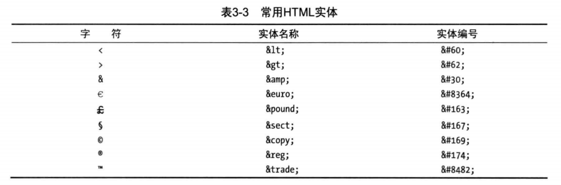

`HTML (Hypertext Markup Language)` 超文本标记语言,诞生于 20 世纪 90 年代初

## 元素

```html
<!-- 开启标签code , 结束标签code,夹在两个标签之间的内容,构成了code元素  -->
<!-- 元素名不区分大小写,推荐小写 -->
<code>hello,world</code>

<!-- 元素的开始和结束标签之间没有内容的称为空元素 -->
<code></code>

<!-- 空元素可以只用一个标签表示,称为自闭和标签 -->
<code />

<!-- 有些元素只能使用一个标签表示,在其中放置任何内容都不符合HTML规范,称为虚元素 -->
<!-- 单个开始标签表示 -->
<!--  -->
<!-- 空元素结构表示  推荐 -->

```

## 元素属性

- 元素可以用属性`attribute`配置
- 属性只能用在`开始标签`或`单个标签`上
- 属性分为`全局属性`和`专有属性(局部属性)`
- 一个元素可以应用多个属性,以空格分隔

```html
<!-- href 是专有属性 -->
<!-- class 是全局属性 -->
<a class="link" href="/apples.html">apples</a>
<!-- 布尔属性可以只写属性名,表示true -->
<input disabled />
<!-- 等同于 -->
<input disabled="" />
<input disabled="disabled" />
<!-- 用户可以自定义属性,必须以data-开头 -->
<input data-my-name="admin" />
```

> 用于处理 HTML 文档的各种软件叫做用户代理`(user agent)`,浏览器是最流行的用户代理,但不是唯一的一种

## 外层结构

```html
<!-- DOCTYPE元素 使用布尔属性HTML 让浏览器明白其处理的是HTML文档 -->
<!DOCTYPE html>
<!-- html元素的开始标签,它告诉浏览器自此直到html结束标签,所有元素内容都应作为HTML处理 -->
<html></html>
```

## 元数据

- 用来向浏览器提供文档的信息
- 包含在`head`元素内部

```html
<!DOCTYPE html>
<html lang="en">
  <head>
    <!-- 这里是元数据 -->
    <title>Document</title>
  </head>
</html>
```

> 注释以`<!--开头`,以`-->`结尾,浏览器会忽略这两个标签之间的一切内容

## 内容

- 文档内容放在`body`元素中
- `body`元素告诉浏览器该向用户显示文档的哪个部分

## 元素关系

- 父元素
- 子元素
- 后代元素
- 兄弟元素

## 元素类型

1. 元数据元素---用来构建 HTML 文档的基本结构,以及就如何处理文档向浏览器提供信息和指示
2. 流元素---是短语元素的超集
3. 短语元素---是 HTML 的基本成分,所有短语元素都是流元素,但并非所有流元素都是短语元素
4. 受限元素---只能用在非常有限的情况下,如:`li`元素

## HTML 实体



## HTML5 全局属性

1. `accesskey`属性

> 用来设置一个或几个选择页面上元素的快捷键

```html
<!-- window中 按住alt+b 或 alt+c 就可以让input获取到焦点-->
<input type="text" accesskey="b" /> <input type="submit" accesskey="c" />
```

2. `class`属性

> 用来将元素归类

3. `contenteditable` 元素

> 让用户能够修改页面上的内容

```html
<p contenteditable>我是可以被编辑的</p>
```

4. `contextmenu`属性

> 鼠标右键弹出快捷菜单,暂无支持这个属性的浏览器

5. `dir`属性

> 规定元素中文字方向

6. `draggable`属性

> 表示元素是否可被拖放

7. `dropzone`属性

> 拖放的区域

8. `hidden`属性

> 隐藏元素

9. `id`属性

> 给元素分配一个唯一标识符,还可以用来导航到文档中的特定位置

```html
<!-- example.html -->
<div id="myelement"></div>
<!-- 使用 example.html#myelement 这个URL即可直接导航至该元素,#myelement称为URL片段标识符 -->
```

10. `lang`属性

> 用来说明元素内容使用的 ISO 语言

11. `spellcheck`属性

> 表明浏览器是否应该对元素的内容进行拼写检查,只有用在用户可以编辑的元素上才有意义

12. `style`属性

> 直接在元素上定义`css`样式

13. `tabindex`属性

> 通过`Tab`键可以切换元素焦点,而`tabindex`属性可以改变默认转移顺序

```html
<!-- tabindex值为1的元素会被第一个选中,
按一下Tab键后,tabindex值为2的元素会被选中,依次类推, 
tabindex值为-1的元素不会在用户按下Tab键后被选中-->
<input type="text" tabindex="1" />
<input type="text" tabindex="-1" />
<input type="text" tabindex="2" />
<input type="text" tabindex="3" />
```

14. `title`属性

> 提供了元素的额外信息,浏览器通常用这个属性显示工具提示
