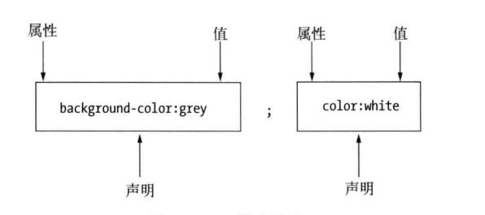

`CSS`(层叠样式表)用来规定`HTML`文档的呈现形式

> `HTML` 中元素的属性对应的英文单词为：`attribute`

> `CSS` 的属性对应的英文单词为：`property`



### 元素内嵌样式

> 使用全局属性`style`

```html
<div style="color:red">我的前景颜色为红色</div>
```

### 文档内嵌样式

> 使用`style`元素

```html
<style type="text/css">
  div {
    color: red;
  }
</style>
```

### 外部样式表

```css
/* styles.css文件 */
div {
  color: red;
}
```

```html
<!-- 引入外部样式表 -->
<link rel="stylesheet" type="text/css" href="styles.css" />
```

- 使用了相同的选择器，后导入的样式会被应用
- 使用`@import`语句可以从一个样式表导入另一个样式表
- 可以出现在`@import`语句之前的只有`@charset`语句,用于声明样式表使用的字符编码
- 如果样式表中未声明所使用的字符编码，那么浏览器将使用载入该样式表的 `HTML` 文档声明的编码，如果 `HTML` 文档也没有声明其编码，默认情况下使用的将是 `UTF-8`
- 浏览器根据层叠和继承规则确定元素属性采用的值

```css
@charset "UTF-8";
/* @import必须位于样式表顶端 */
@import "styles.css";
span {
  color: red;
}
```

### 浏览器样式

浏览器样式（更恰当的名称是用户代理样式）是元素尚未设置样式时浏览器应用在它身上的默认样式

### 用户样式

大多数浏览器都允许用户定义自己的样式表，这个功能用的人不多

### 样式层叠

浏览器显示元素时求索 CSS 属性值的次序：
元素内嵌样式 > 文档内嵌样式 > 外部样式 > 用户样式 > 浏览器样式

> 元素内嵌样式 , 文档内嵌样式 , 外部样式 合称 `作者样式`

> 定义在用户样式表中的样式称为`用户样式`

> 有浏览器定义的样式称为`浏览器样式`

将样式属性值标记为重要，浏览器会优先考虑

```CSS
a {
    color: red !important;
}
```

> 能凌驾于作者定义的重要属性值之上的只有用户样式表中定义的重要属性值，对于普通属性，作者样式中的值优先于用户样式中的值，对于重要属性情况正好相反
