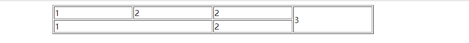
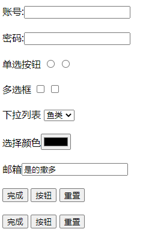

- 超文本标记语言
- 负责网页的结构
- 使用标签的形式标识网页的不同部分
- 超文本指超链接,跳转页面
## 实体(转义字符)
``` html
&nbsp;  <!--   空格 -->
&gt;    <!--   大于 -->
&lt;    <!--   小于 -->
&copy;  <!--   版权符号 -->
```
## meta
> 设置网页元数据
> name 指定数据的名称
> content 指定数据的内容
``` html 
<!-- 网站的关键字,可以同时指定多个关键字 -->
<meta name="keywords" content="HTML5,CSS3,前端">
<!-- 网站描述 -->
<meta name="description" content="京东JD.COM-专业的综合网上购物商城">
<!-- 重定向到百度 -->
<meta http-equiv="refresh" content="3;url=https://www.baidu.com">
```
## 语义化标签
``` html
<!-- 为标题分组 -->
<hgroup>
  <h1>1</h1>
  <h2>2</h2>
</hgroup>
<!-- 长引用 -->
<blockquote>11</blockquote>
<!-- 短引用 -->
<q>11</q>
```
- 块元素(block element)
> 页面布局
> 可以内嵌行内元素
> p元素内不能放块元素
- 行内元素(inline element)
> 包裹文字
> 不能内嵌块元素

浏览器在解析网页时,会自动修正不符合规范的内容,比如:
- 标签写在根元素的外部
- p元素嵌套了块元素
- 根元素中出现了除`head`和`body`以外的子元素
``` html
<!-- 网页头部 -->
<header></header>
<!-- 网页主体,一个页面只能有一个 -->
<main></main>
<!-- 网页底部 -->
<footer></footer>
<!-- 网页的导航 -->
<nav></nav>
<!-- 网页的侧边栏 -->
<aside></aside>
<!-- 独立的文章 -->
<article></article>
<!-- 独立的区块,上面的标签都不能表示时使用 -->
<section></section>

<!-- 没有语义,是一个区块,常用,可代替上面所有标签 -->
<div></div>
<!-- 没有语义,行内元素,常用,用于网页中选中文字 -->
<span></span>
```
``` html
<!-- 无序列表,常用 -->
<ul>
  <li></li>
  <li></li>
</ul>
<!-- 有序列表 -->
<ol>
  <li></li>
  <li></li>
</ol>
<!-- 定义列表 -->
<dl>
  <dt>定义的内容</dt>
  <dd>对内容的解释说明</dd>
</dl>
<!-- 列表之间可以相互嵌套 -->
```
## 超链接
- 跳转页面或当前页面的其他位置
- 行内元素,但可以嵌套任何元素
``` html 
<!-- 
  target属性: 指定超链接打开的位置
  可选值:
    _self: 默认值,在当前页面打开
    _blank: 在新页面中打开
-->
<a href="https://www.baidu.com">外部网站</a>
<a href="./b.html">内部网站,相对路径,./表示当前文件所在的目录</a>
<a href="#">回到顶部</a>
<a href="#bottom">跳转到id为bottom的元素的位置</a>
<a href="javascript:;">点击什么都不会发生</a>
```
## 图片标签
::: tip 提示
 - 在PC端,不建议修改图片大小,大图修改成小图浪费内存,小图修改成大图失真
 - 但在移动端经常将大图修改成小图
:::
``` html 
<!-- 路径规则与超链接相同 -->

```
## 内联框架
::: tip 提示
 SEO不友好
:::
``` html
<!-- 用于向当前页面引入一个其他页面
frameborder 指定内联框架的边框
 -->
<iframe src="https://www.qq.com" width="800" height="600" frameborder="0"></iframe>
```
## 音频标签
``` html
<!-- 
  controls 是否允许用户控制播放
  autoplay 是否自动播放
  loop     是否循环
 -->
<!-- 方式一 -->
<audio src="./source/audio.mp3" controls autoplay loop></audio>
<!-- 方式二 -->
<audio controls>
    <source src="./source/audio.mp3">
</audio>
<!-- 方式三 -->
<embed src="./source/audio.mp3" type="audio/mp3">
```
``` html
<!-- 
  引入视频
  使用方式和audio基本一致
 -->
<!-- 方式一 -->
<video src="./source/audio.mp4"></video>
<!-- 方式二 -->
<video controls>
    <source src="./source/audio.mp4">
</video>
<!-- 方式三 -->
<embed src="./source/audio.mp4" type="audio/mp4">
```
## 表格
### 基础表格
``` html
<table border="1" width="50%" align="center">
  <!-- tr 表示行 -->
  <tr>        
    <!-- td 表示单元格 -->
    <td>1</td>
    <td>2</td>
    <td>2</td>
    <!-- 纵向合并单元格 -->
    <td rowspan="2">3</td>
  </tr>
  <tr>
    <!-- 横向合并单元格 -->
    <td colspan="2">1</td>
    <td>2</td>
  </tr>
</table>
```

### 长表格
``` html
<table border="1" width="50%" align="center">
  <!-- 头部 -->
  <thead>
    <tr>
      <!-- 表示头部单元格 有字体加粗,居中的效果 -->
      <th>111</th>
      <th>111</th>
    </tr>
  </thead>
  <!-- 主体 -->
  <tbody>
    <tr>
      <td>22</td>
      <td>22</td>
    </tr>
    <tr>
      <td>33</td>
      <td>33</td>
    </tr>
  </tbody>
  <!-- 底部 -->
  <tfoot>
    <tr>
      <td>合计</td>
      <td>44</td>
    </tr>
</tfoot>
</table>
```

### 表格样式
``` html
<table>
  <tr>
    <td>11</td>
    <td>11</td>
    <td>11</td>
  </tr>
  <tr>
    <td>22</td>
    <td>22</td>
    <td>22</td>
  </tr>
</table>
```
``` css
table{
  width: 50%;
  margin: 0 auto;
  border: 1px solid black;
  /* 指定边距的距离 */
  /* border-spacing: 0px; */
  /* 设置边框合并 */
  border-collapse: collapse;
}
td{
  border: 1px solid black;
  height: 30px;
  /* 默认情况下,元素在td中是垂直居中的 ,可以下面属性修改(只有td可以修改子元素,其他只能修改文字)*/
  vertical-align: middle;
  text-align: center;
}
/* 虽然表格中没有使用tbody,但浏览器自动创建了,并将tr都放到了里面,所以tr不是table的子元素 */
/* table > tr:nth-child(odd) {
  background-color: cadetblue;
} */
tbody > tr:nth-child(odd) {
  background-color: cadetblue;
}
```


>依赖表格单元格可以修改子元素的特性,可以进行下面的操作
``` html
<div class="box1">
  <!-- 行内元素,文字 -->
  <span>555span</span>
</div>
```
``` css
.box1{
  width: 200px;
  height: 200px;
  background-color: chartreuse;
  display: table-cell;
  text-align: center;
  vertical-align: middle;
}
```


``` html
<div class="box1">
  <div class="box2"></div>
</div>
```
``` css
.box1 {
  width: 200px;
  height: 200px;
  background-color: chartreuse;
  /* 将其设置为单元格 td */
  display: table-cell;
  vertical-align: middle;
}
.box2 {
  width: 100px;
  height: 100px;
  background-color: red;
  margin: 0 auto;
}
```

## 表单
``` html
<!-- action 远程地址 -->
<form action="a.html">
  <!-- 
    name 为提交时的键 
    value 为值
  -->
  账号:<input type="text" name="username">
  <br><br>
  密码:<input type="text" name="password">
  <br><br>
  单选按钮 <input type="radio" name="sex" value="男">
  <input type="radio" name="sex" value="女">
  <br><br>
  多选框
  <input type="checkbox" name="apple" value="苹果">
  <input type="checkbox" name="banana" value="香蕉">
  <br><br>
  下拉列表
  <select name="variety">
    <option value="fish">鱼类</option>
    <option value="birds">鸟类</option>
  </select>
  <br><br>
  <input type="submit" value="完成">
</form>
```
