- 层叠样式表
- 负责网页的表现
## CSS编写的位置
- `内联样式(行内样式)`
  - 样式只对当前元素有效
  - 开发中不要使用内联样式
- `内部样式表`
  - 方便对样式复用
  - 但只对本页面有效
- `外部样式表`
  - 可以跨页面复用
  - 通过`link`标签引入
  - 使用到浏览器的缓存机制,从而加快网页的加载速度
::: tip 提示
 浏览器第一次加载网页时,会将外部资源(图片,音频,css文件等)缓存到本地,第二次加载时就不用再去请求服务器了
:::
## 常用选择器
- 元素选择器
- 类选择器
- id选择器
- 通配符选择器(`*`)
## 复合选择器
- 交集选择器
``` html
<div class="red"></div>
```
``` css 
/* 
选择 div元素 且 类名为red
注意点:
 1. 交集选择器中如果有元素选择器,必须使用元素选择器开头
 2. div#box1{}   不建议使用,因为id选择器已经确定了他的唯一性

*/
div.red {}
```
- 并集选择器
``` html
<div></div>
<p></p>
```
``` css 
/* 
同时选择 div元素 和 p元素
*/
div,p {}
```
- 关系选择器
  - 父元素
    - 直接包含子元素
  - 子元素
    - 直接被父元素包含
    - `父元素 > 子元素` 选中指定父元素的指定子元素
  - 祖先元素
    - 直接或间接包含后代元素
  - 后代元素
    - 直接或间接被祖先元素包含
    - `祖先元素 后代`    选中指定元素内的指定后代元素
  - 兄弟元素
    - 拥有相同父元素
    - `前一个 + 后一个`  选择紧挨着的下一个兄弟
    - `前一个 ~ 后一个`  选择后面的所有兄弟
## 属性选择器
- `[属性名]  `       含有指定属性的元素
- `[属性名=属性值]`   含有指定属性和属性值的元素
- `[属性名^=属性值]`  属性值以指定值开头的元素
- `[属性名&=属性值]`  属性值以指定值结尾的元素
- ` [属性名*=属性值] ` 属性值中含有某值的元素的元素
## 伪类选择器
- 不存在的类,用来描述元素的特殊状态
- `:`开头
## 伪元素选择器
- 不存在的元素,用来表示特殊的位置
- `::` 开头
## 继承
- 为一个元素设置的样式同时会应用到它的后代元素上
- 利用继承可以将一些通用的样式统一设置到公共的祖先元素上
- 背景,布局相关的样式不会被继承
## 选择器权重
| 内联样式         |   id选择器   |           类和伪类选择器 |  元素选择器 | 通配符选择器
| :------: | :------: | :------: |:------: |:------: |
| 1,0,0,0 | 0,1,0,0 |  0,0,1,0   | 0,0,0,1   | 0,0,0,0 |
- 继承的样式没有优先级
- 计较优先级时,将所有的选择器的优先级相加,结果越大,优先级越高
- 分组选择器是单独计算的
- 如果优先级相同,显示最后定义的样式
- 样式后面添加`!important`会获取到最高的优先级,慎用,想改就改不了了
## 长度单位
- `em`
  - 相对于自身的字体大小来计算
  - `1em = 1font-size`
  - em会根据字体大小的改变而改变
- `rem`
  - 相对于根元素的字体大小来计算
## 颜色单位
- 颜色名
  - `red`,`blue`,`green ...`
- RGB
  - 光的三原色:`red`,`green`,`blue` 
  - 每种颜色的范围在`0-255(0% -100%)` 之间
  - 语法: `RGB(0,255,255)`
- RGBA
  - 在`RGB`的基础上增加了透明度
  - 透明度的范围: `0 - 1`之间
  - 语法:`RGBA(255,0,0,0.2)` 
- 十六进制
  - 语法: `#ff0044`
  - `ff`代表红色的浓度,`00`代表绿色的浓度,`44`代表蓝色的浓度
  - 每种颜色的浓度范围: `00- ff`
  - 如果颜色两位相同可以简写,如:`#f04`
- HSL
  - H  色相,颜色(0 - 360)
  - S  饱和度,颜色的浓度(0% - 100%)
  - L  亮度,颜色的亮度(0% - 100%) 
## 文档流
- 网页是一个多层的结构,一层摞着一层
- 通过css可以分别为每一层设置样式
- 用户只能看到最顶层
- 最底层是文档流,元素默认都在文档流中排列
- 元素主要有两个状态:`在文档流中`和`脱离文档流`
- 元素在文档流中的特点:
  - 块元素
    - 自上向下垂直排列,独占一行
    - 默认宽度是父元素的全部
    - 默认高度是被内容撑开的高度 
  - 行内元素 
    - 从左向右水平排列,只占自身大小 
    - 默认宽高都是被内容撑开
## 盒子模型
- css将页面中的所有元素都设置成了一个矩形的盒子
- 每个盒子由以下部分组成
  - 内容区(content)
    - 宽高由`width`和`height`设置 
  - 内边距(padding)
  - 边框(border)
    - 位于盒子边缘,但还属于盒子内部,出了边框都是盒子的外部 
  - 外边距(margin)
### 边框
``` css 
/* 
通用
四个值表示:上,右,下,左
三个值表示:上,左右,下
两个值表示:上下,左右
一个值表示:上下左右
*/
border-width: 10px 10px 10px 10px;  /* 边框宽度 */
border-color: red red;  /* 边框颜色 如果不指定颜色,会使用color(其实是前景色)的值 */
border-style: solid solid solid;  /* 边框样式 */

border-top-width: 10px;    /* 上边框的宽 */
border-left-width: 10px;   /* 左边框的宽 */
border-right-width: 10px;  /* 右边框的宽 */
border-bottom-width: 10px; /* 下边框的宽 */
/* 简写形式 设置4个边框 值无序*/
border: 10px solid red;
/* 简写形式 设置单个边框 值无序*/
border-top: 10px solid red;
border-right: 10px solid red;
border-bottom: 10px solid red;
border-left: 10px solid red;
/* 多个属性配合使用,右边框不加任何效果 */
border: 10px solid red;
border-right: none;
```
### 内边距
- 内容区和边框之间的距离为内边距
- 内边距的设置会影响盒子大小
- 内容区的背景颜色会延伸到内边距上
- 在div1里嵌套一个div2,div1设置宽,高,边框和内边距,div2设置宽高100%并设置背景颜色,这样可以很清晰看到哪块是内边距
- 可见框大小 = 内容区 + 内边距 + 边框
### 外边距
- 会影响盒子的位置
### 盒子的水平布局
``` html
<div class="outer">
    <div class="inner"></div>
</div>
```
``` css
.outer {
  width: 800px;
  height: 200px;
  border: 10px red solid;
}
.inner {
  width: 200px;
  height: 200px;
  background-color: aqua;
}
```
一个元素在其父元素中,水平布局必须满足以下等式:
  - `margin-left` + `border-left` + `padding-left` + `width` + `padding-right` + `border-right` + `margin-right` = 父元素内容区的宽度
  - 如果相加的结果使等式不成立,则称为过度约束,等式会自动调整
    - 如果这七个值没有为`auto`的情况,则浏览器自动调整`margin-right`值以使等式满足
    - 只有`width`,`margin-left`和`margin-right`可以设置为`auto`
    - 如果某个值为`auto`,则会自动调整为`auto`的值以使等式成立
    - `width`的默认值是`auto`
    - 如果将宽度和一个外边距设置为`auto`,则宽度会调整到最大,设置为`auto`的外边距会自动为0
    - 如果三个值都是`auto`,则外边距为0,宽度最大
    - 如果两个外边距是`auto`,宽度固定,会将外边距设置为相同的值
      - 利用这个特点可以使一个元素在其父元素中水平居中
``` css
/* 水平居中 */
.inner {
  width: 200px;
  margin: 0 auto;
}
```
### 盒子的垂直布局
> 如果子元素的大小超过了父元素,子元素会从父元素溢出,使用`overflow`属性来设置父元素如何处理溢出的子元素
 - 可选值
   - `visible`默认值,子元素从父元素中溢出,在父元素外部显示
   - `hidden`溢出内容会被隐藏
   - `scroll`使父元素可以水平/垂直滚动
   - `auto` 根据内容自适应生成滚动条
 - `overflow-x`,`overflow-y`分别设置溢出部分的水平和垂直,值同上
``` html
<div class="box1">
  <div class="box2"></div>
</div>
```
``` css
.box1 {
  width: 300px;
  height: 200px;
  background-color: aqua;
  overflow: hidden;
}
.box2 {
  width: 200px;
  height: 400px;
  background-color: rgb(187, 123, 40);
}
```
> **相邻的垂直方向外边距**会发生重叠
- 兄弟元素
  - 如果都是正值,取最大值
  - 如果一正一负,取两者的和
  - 如果都是负,取两者中绝对值最大的
``` html
<div class="box1"></div>
<div class="box2"></div>
```
``` css
.box1 {
  width: 200px;
  height: 100px;
  background-color: aqua;
  margin-bottom: 50px;
}
.box2 {
  width: 200px;
  height: 100px;
  background-color: aquamarine;
  margin-top: 20px;
}
```
- 父子元素
  - 子元素会传递给父元素上外边距,会影响页面布局
    - 子元素使用`padding-top`,但父元素需要改高度
    - 给父元素一个边框,这样就不相邻了,但父元素的高和子元素的上外边距需要改
``` html
<div class="box1">
  <div class="box2"></div>
</div>
```
``` css
.box1 {
  width: 200px;
  height: 100px;
  background-color: aqua;
}
.box2 {
  width: 50px;
  height: 50px;
  background-color: aquamarine;
  margin-top: 100px;  
}
```
### 行内元素的盒模型
>行内元素的盒模型和块元素一样,不过有以下区别:
- 不能通过`width`和`height`设置内容区的宽高,由它里面的内容决定
- 可以设置`padding,margin,border`,,相邻垂直方向不会影响页面布局
  - `margin` 只有左右生效,且不会重叠
>`display`用来设置元素显示的类型
-  `inline`   行内元素
-  `block`    块元素
-  `inline-block` 行内块元素
   - 既可以通过`width`和`height`设置内容区的宽高,有不会独占一行
- `table` 表格
- `none`  隐藏元素,不占据空间
  - `visibility` 用来设置元素的显示状态
    - `visible` 默认值,正常显示
    - `hidden` 隐藏元素,但依然占有空间
## 浏览器的默认样式
取消浏览器默认样式:
- 方式一:
``` css
*{
  margin: 0;
  padding: 0
}
ul{
  list-style: none;
}
```
- 方式二: 
``` html
<!-- 对不同的浏览器在渲染网页元素的时候形式更统一 -->
<link rel="stylesheet" href="normalize.css">
<!-- 去除了浏览器的默认样式 -->
<link rel="stylesheet" href="reset.css">
```
## 盒子大小
默认情况下,`盒子可见框`的大小由`内容区`,`内边距`和`边框`共同决定
- `box-sizing` 用来设置盒子大小的计算方式
  - `content-box`  默认值,`width`和`height`设置内容区的宽高
  - `border-box`   `width`和`height`设置`盒子可见框`的宽高

## 轮廓/阴影/圆角

``` css
/*
 设置元素的轮廓,用法和border一样
 轮廓不会影响到可见框的大小 
 */
outline: 1px solid red
```

``` css
/*
用来设置元素阴影
轮廓不会影响到可见框的大小 
第一个值 水平偏移量  正值向右 负值向左
第二个值 垂直偏移量  正值向下 负值向上
第三个值 阴影模糊半径
第三个值 阴影颜色
 */
box-shadow: 10px 10px 10px red;
```
``` css
/* 圆角  */
border-radius: 50%;
```
## 浮动
- `float`属性设置元素的浮动
  - `none` 默认值,元素不浮动
  - `left` 元素向左移动
  - `right`元素向右移动 

- 浮动的特点
  - 当一个元素浮动之后，它会被移出正常的文档流，然后向左或者向右平移，一直平移直到碰到了所处的容器的边框，或者碰到另外一个浮动的元素
  - 如果浮动元素的上边是一个没有浮动的块元素,则浮动元素无法上移
  - 多个浮动元素在一行放不开会像行内元素一样另起一行
  - 浮动元素不会越级排列

- 浮动主要作用是制作一些水平方向的布局
- 浮动不会盖住文字,文字会自动环绕在浮动元素的周围
  - 利用这个特点可以设置文字环绕图片的效果 
- 脱离文档流后,块元素和行内元素拥有了类似于`行内块元素`的特性
``` html
 <div class="main"></div>
```
``` css
/* 设置了浮动,这个div已经不在body中了,独立了 */
.main {
  width: 200px;
  height: 200px;
  background-color: antiquewhite;
  float: left;
}
```
- 浮动产生的问题
::: warning 高度塌陷
在浮动布局中,父元素的高度默认被子元素撑开,当子元素设置浮动后,其脱离了文档流,导致父元素的高度丢失,同级的元素上移,页面布局混乱
:::
解决方式一: 创建`BFC`
``` html
<div class="outer">
  <div class="inner"></div>
</div>
```
``` css
.outer{
  border: 1px solid red;
  /*开启BFC,计算BFC的高度时，浮动元素也参与计算 */
  overflow: hidden;
}
.inner{
  width: 100px;
  height: 100px;
  background-color: aqua;
  /* 设置浮动后塌陷了 */
  float: left;  
}
```
解决方式二: 使用`clear`属性,作用是清除浮动元素对当前元素所产生的的影响
> 可选值:
> - `left` 清除左侧浮动元素对当前元素的影响
> - `right` 清除右侧浮动元素对当前元素的影响
> - `both` 清除两侧中最大影响的那侧
> - 原理是设置清除浮动之后,浏览器会自动为元素添加一个上外边距,以使其位置不受其他元素的影响
``` html
<div id="box1">
  <div id="box2"></div>
</div>
```
``` css
#box1{
 border: 1px solid red;
}
#box2{
  width: 100px;
  height: 100px;
  background-color: springgreen;
  float: left;
}
/* ::after 默认情况下是行内元素,所以需要将他装换为块元素,才能撑起高度 */
#box1::after{ 
  content: '';
  display: block;
  clear: left;
}
```
::: warning 外边距重叠
父子元素在垂直方向外边距重叠时,子元素设置`margin-top`值会传递给父元素
:::
``` html
<div class="box1">
  <div class="box2"></div>
</div>
```
``` css
.box1{
width: 100px;
height: 100px;
background-color: red;
}
.box2{
  width: 50px;
  height: 50px;
  background-color: springgreen;
  margin-top: 50px;
}
```
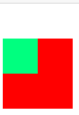
> - 使用`::before` + `display: table` 可以解决这种问题
``` css
.box1::before{
  content: '';
  display: table;
}
```
::: tip 多功能样式
`clearfix` 这个样式可以同时解决高度塌陷和外边距重叠的问题
:::
``` html
<div class="box1 clearfix">
  <div class="box2"></div>
</div>
```
> - `::before` 创建一个伪元素，其将成为匹配选中的元素的第一个子元素,默认为行内元素
> - `::after`创建一个伪元素，作为已选中元素的最后一个子元素,默认是行内元素
> - `content` 为内容,有内容`box1`和`box2`外边距就不相邻了就不重叠了,但是会显示内容
> - `display: table` 指定对象作为块元素级的表格
> - `clear: both;` 清除浮动对伪元素的影响,不会被覆盖(子元素是浮动的情况下)
``` css
.clearfix::before,
.clearfix::after{
  content: '';
  display: table;
  clear: both;
}
```
## BFC
### 定义
1. 首先要知道`HTML`元素在历史上被分类为块级元素(`block-level elements`)和行内元素(`inline-level elements`)
2. 格式化上下文(`Formatting Context`)是页面的一块渲染区域,有一套渲染规则,比较常见的格式化上下文有
  - `Block Fomatting Context`,简称`BFC`
  - `Inline Fomatting Context`,简称`IFC`
3. `block-level elements`会生成`block-level box` ,并参与`Block Fomatting Context`
4. `inline-level elements`会生成`inline-level box` ,并参与`Inline Fomatting Context`
###  `BFC`的布局规则
> 块格式化上下文包含创建它的元素内部的所有内容
- 内部的盒子会在垂直方向，一个接一个地放置。
- 同一个`BFC`的两个相邻盒子的`margin`会发生重叠。
- `BFC`的区域不会与`float box`重叠。
- `BFC`就是页面上的一个隔离的独立容器，容器里面的子元素不会影响到外面的元素,外面的元素也影响不到里面的子元素
- 计算`BFC`的高度时，浮动元素也参与计算。
### 创建块格式化上下文
- 根元素`<html>`
- 浮动元素（元素的 `float` 不是` none`）
- 绝对定位元素（元素的 `position` 为 `absolute` 或 `fixed`）
- `overflow` 值不为 `visible` 的块元素
- `display: flow-root` 无副作用
- ...
### 示例
> 1.同一个 `BFC` 下外边距会发生折叠
``` html
<p></p>
<p></p>
```
``` css
p{
  width: 100px;
  height: 100px;
  background-color: aquamarine;
  margin: 20px;
}
```
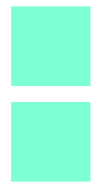
>因为两个 div 元素都处于同一个 BFC 容器下 (根元素`<html>`),如果想要避免外边距的重叠，可以将其放在不同的` BFC` 容器中
``` html
<div>
  <p></p>
</div>
<div>
  <p></p>
</div>
```
``` css
div{
  overflow: hidden;
}
p{
  width: 100px;
  height: 100px;
  background-color: aquamarine;
  margin: 20px;
}
```
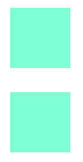
> 2. BFC 可以包含浮动的元素（清除浮动）
``` html
<div class="box1">
  <div class="box2"></div>
</div>
```
``` css
.box1{
  border: 1px solid red;
}
.box2{
  width: 100px;
  height: 100px;
  background-color: seagreen;
  float: left;
}
``` 
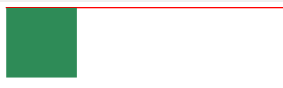
>由于容器内元素浮动，脱离了文档流,导致父元素高度塌陷,如果触发容器的BFC,容器便会包裹着浮动元素
``` html
<div class="box1">
  <div class="box2"></div>
</div>
```
``` css
.box1{
  border: 1px solid red;
  overflow: hidden;
}
.box2{
  width: 100px;
  height: 100px;
  background-color: seagreen;
  float: left;
}
``` 
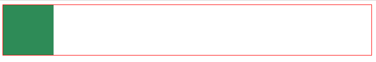
> 3. BFC 可以阻止元素被浮动元素覆盖
``` html
<div id="box1">我是一个左浮动的元素</div>
<div id="box2">
  我没有设置浮动,也没有触发BFC width: 200px;
  height: 200px;
  background-color: slategrey;
</div>
```
``` css
#box1{
  width: 100px;
  height: 100px;
  background-color: skyblue;
  float: left;
}
#box2{
  width: 200px;
  height: 200px;
  background-color: slategrey;
}
```
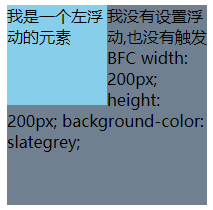
> 因为文本信息不会被浮动元素覆盖,所以会出现文字环绕效果,但第二个元素被浮动元素覆盖了
``` html
<div id="box1">我是一个左浮动的元素</div>
<div id="box2">
  我没有设置浮动,也没有触发BFC width: 200px;
  height: 200px;
  background-color: slategrey;
</div>
```
``` css
#box1{
  width: 100px;
  height: 100px;
  background-color: skyblue;
  float: left;
}
#box2{
  width: 200px;
  height: 200px;
  background-color: slategrey;
  overflow: hidden;
}
```
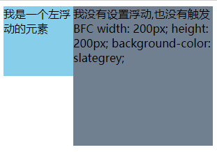
## 定位
- `position`
- 可选值
  - `ststic` 默认值,没有开启定位
  - `relative` 相对定位 
    - 相对于自身
    - 不设置偏移量`元素`不会发生变化
    - 会提升元素层级
    - 不会脱离文档流
    - 不会改变元素性质
  - `absolute` 绝对定位
    - 不设置偏移量`元素的位置`不会发生变化
    - 会提升元素层级
    - 会脱离文档流
    - 会改变元素性质,行内元素变成块元素,块的宽高被内容撑开
    - 绝对定位是相对于其`包含块`进行定位的
  - `fixed` 固定定位 
    - 也是一种绝对定位,唯一的不同是永远参照浏览器的视口进行定位
  - `sticky` 粘滞定位(兼容性不好)
    - 与相对定位的特点基本一致,不同的是它会在元素到达某个位置时将其固定 
::: tip 包含块(containing block)
- 正常文档流中,包含块是离当前元素最近的祖先块元素
- 绝对定位的包含块是离他最近的开启了定位的祖先元素,如果没有,则是根元素(`html`)
:::
### 绝对定位元素布局
> 水平方向布局
- `left + margin-left/right + border-left/right + padding-left/right + width + right = 包含块的内容区的宽度` 
- 可设置`auto`的值为:`margin,width,left,right`
``` html 
<div class="box1">
  <div class="box2"></div>
</div>
```
``` css
  .box1{
    width: 300px;
    height: 300px;
    background-color: aqua;
    position: relative;
  }
  .box2{
    width: 100px;
    height: 100px;
    background-color: antiquewhite;
    position:absolute;
    left: 0;
    right: 0;
    margin-left: auto;
    margin-right: auto;
  }
```
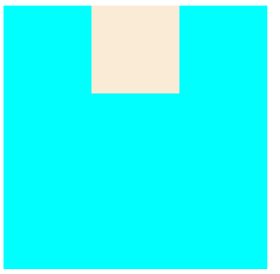
> 垂直方向布局
- `top + margin-top/bottom + border-top/bottom + padding-top/bottom + height + bottom = 包含块的内容区的高度` 
``` html 
<div class="box1">
  <div class="box2"></div>
</div>
```
``` css
  .box1{
    width: 300px;
    height: 300px;
    background-color: aqua;
    position: relative;
  }
  .box2{
    width: 100px;
    height: 100px;
    background-color: antiquewhite;
    position:absolute;
    top: 0;
    bottom: 0;
    margin-top: auto;
    margin-bottom: auto;
  }
``` 
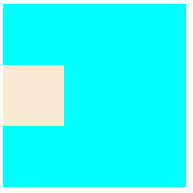

> 垂直水平居中
``` html 
<div class="box1">
  <div class="box2"></div>
</div>
```
``` css
  .box1{
    width: 300px;
    height: 300px;
    background-color: aqua;
    position: relative;
  }
  .box2{
    width: 100px;
    height: 100px;
    background-color: antiquewhite;
    position:absolute;
    top: 0;
    bottom: 0;
    left: 0;
    right: 0;
    margin: auto;
  }
``` 
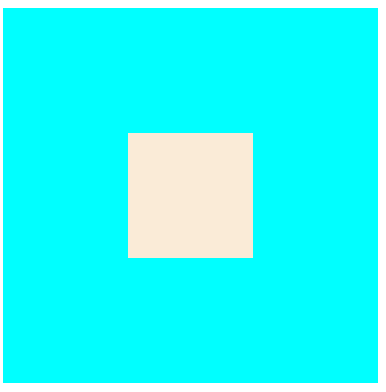
### 元素层级
> - 如果元素的层级一样,优先显示靠下的元素
> - 祖先元素的层级再高也不会覆盖后代元素
> - `z-index` 可以控制元素的层级,只对定位元素有效
``` html
<div class="box1">1</div>
<div class="box2">2</div>
<div class="box3">3</div>
```
``` css
body{
  font-size: 30px;
}
.box1 {
  width: 100px;
  height: 100px;
  background-color: aqua;
  position: absolute;
}
.box2{
  width: 100px;
  height: 100px;
  background-color:rgba(255, 20, 10, 0.5);
  position: absolute;
  left: 30px;
  top: 30px;
}
.box3{
  width: 100px;
  height: 100px;
  background-color:rgba(255, 200, 10,1);
  position: absolute;
  left: 60px;
  top: 60px;
}
```
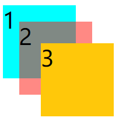
## 字体
>`@font-face` 可以将服务器中的字体直接提供给用户使用
``` css
@font-face {
  font-family: 'my-font';   /* 自定义字体的名字 */
  src: url('服务器中字体的路径') format('truetype'); /* format字体的格式,一般不用加 */
}
.b{
  font-family: my-font;
}
```
::: danger @font-face带来的问题
- 加载速度相对于直接使用本地的字体要慢
- 版权问题,`@font-face`使用的是你提供给客户的非授权字体时侵权,而`font-family`只是建议,使用的是客户本地的字体,你并没有实际提供
:::
> 将图标设置成字体,通过`@font-face`引入,这样就可以使用字体形式的图标了
- [fontawesome-字体图标库](https://fontawesome.com/)
  - 只需要解压后将`css`和`webfonts`文件夹粘到项目里,然后引入`css/all.css`文件
  ``` html
  <!-- 方式一: 实体 -->
  <i class="fas">&#xfof3;</i>
  <!-- 方式二: 类名 -->
  <i class="fas fof3"></i>
  <!-- 方式三: 伪元素 -->
  <i></i>
  ```
  ``` css
  li::before{
    content: '\f1b0';   /* 字体编码 */
    font-family: 'Font Awesome 5 Free';
    font-weight: 900;
  }
  ```
- [iconfont-阿里巴巴矢量图标库](https://www.iconfont.cn/)
  - 将喜欢的图标入库并添加到项目中,然后下载到本地
  - 在页面引入`iconfont.css`
  ``` html
  <!-- 方式一: 实体 -->
  <i class="iconfont">&#x361c</i>
  <!-- 方式二: 类名 -->
  <i class="iconfont icon-qitalaji"></i>
  <!-- 方式三: 伪元素 -->
  <i></i>
  ```
  ``` css
  i::before{
    content: '\e625';
    font-family: 'iconfont';
  }
  ```
> 行高(`line height`) 指的是文字占有的实际高度
- `line-height`可以设置行高,值可以是`px`,`em`,如果是个整数,行高将会是字体的指定倍数
- 字体框就是字体存在的格子,设置`font-size`实际上就是设置字体框的高度
- 行高会在字体框的上下平均分配
- 多行情况下,`行间距 = 行高 - 字体大小`
- 字体简写,`font: 字体大小/行高 字体` 行高可以省略不写,有默认值
- `text-align` 文本水平对齐
- `vertical-align` 文本垂直对齐
  - `img`在块元素中,底部会有缝隙,这是因为`img`是替换元素,和字体的特点类似,也是按照基线对齐的,只要给`img`设置这个属性,不按照基线对齐就不会有缝隙了
- `text-decoration` 设置文本修饰,上划线,下划线等
- `white-space`  设置网页如何处理留白,不换行,保留空白等
- `text-overflow: ellipsis` 溢出的内容设置省略号 
``` html
<p>是的撒多撒奥dsdadsadadasd是的撒多撒奥dsdadsadadasd</p>
```
``` css
p{
  width: 200px;
  white-space: nowrap;
  overflow: hidden;
  text-overflow: ellipsis;
}
```
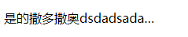
## 背景
``` css
/* 背景颜色 */
background-color: aquamarine;     /* 背景颜色 */
background-image: url("xx.png");  /* 背景图片 */
background-repeat: repeat-x;      /* 背景重复方式 */
background-position: 10px 20px;   /* 背景图片位置 */
background-clip: border-box;      /* 元素的背景（背景图片或颜色）是否延伸到边框、内边距盒子、内容盒子下面 */
background-origin: border-box;    /* 指定背景图片原点位置的背景相对区域*/
background-size: 100%;            /* 设置背景图片大小 */
background-attachment: scroll;    /* 决定背景图像的位置是在视口内固定，或者随着包含它的区块滚动 */
/* 
背景的简写属性,没有顺序要求,也没有哪个属性是必写的,但要注意:
1. background-size 必须写在 background-position 的后边并用`/`隔开
2. background-origin 要在 background-clip 前面
*/
```
- 图片属于网页中的外部资源,外部资源都需要浏览器单独发送请求加载,浏览器加载外部资源时时按需加载的
- 可以将多个小图片统一保存到一个大图片中,然后调整`background-position`来显示相应的图片,这种图片会同时加载到网页中,可以有效避免出现闪烁的问题,这种技术在网页中应用广泛,被称为`css-sprite`,这种图我们称为雪碧图
> 一次性将多个图片加载进页面,降低请求次数,加快访问速度,提升用户体验
## 渐变
> - 实现从一个颜色向其他颜色过渡的效果
> - 渐变是颜色,但拥有图片的特性,需要通过`background-image`来设置

### 线性渐变
1. `linear-gradient()` 函数构建一系列**垂直**于渐变线的着色线
  - 第一个参数控制方向,可以是`to top`,`to right top`,`90deg`,`0.5turn`
  - 可以同时指定多个颜色,默认平均分配,也可以手动分配
``` css
/* 渐变轴为45度，从蓝色渐变到红色 */
background-image: linear-gradient(45deg, blue, red);
/* 从右下到左上、从蓝色渐变到红色 */
background-image: linear-gradient(to left top, blue, red);
/* 从下到上，从蓝色开始渐变、到高度40%位置是绿色渐变开始、最后以红色结束 */
background-image: linear-gradient(0deg, blue, green 40%, red);
/* 从上到下，从红色50px处开始渐变、到60px位置是灰色渐变开始到结束 */
background-image: linear-gradient(red 50px,#eee 60px);
```
2. `repeating-linear-gradient()` 在所有方向上重复渐变以覆盖其整个容器
> 比如从 `red 50px`开始,`blue 60px`结束,`60-50=10`,将这`10px`的渐变重复覆盖整个容器
### 径向渐变

1. `radial-gradient()` 创建了一个图像，该图像是由从原点发出的两种或者多种颜色之间的逐步过渡组成。它的形状可以是`圆形（circle）`或`椭圆形（ellipse）`
 - `radial-gradient(大小 at 位置, 颜色 位置, 颜色 位置, 颜色 位置, ...)`
   - 大小: 
      - `circle 圆形`
      - `ellipse 椭圆形`
      - `closest-side 近边`
      - `closest-corner 近角` 
      - `farthest-side 远边`
      - `farthest-corner 远角`
      - 也可以是像素值
   - 位置:
     - `top`
     - `right`
     - `left`
     - `bottom` 
     - 可以是像素值
``` css
/* 径向渐变的宽高为10px */
background-image: radial-gradient(10px 10px,red,blue)
/* 径向渐变的形状为圆形 */
background-image: radial-gradient(circle,red,blue)
/* 径向渐变的形状为椭圆形 */
background-image: radial-gradient(ellipse,red,blue)
/* at后面的值设置径向渐变的位置 */
background-image: radial-gradient(10px 10px at 10px 0,red,blue)
```