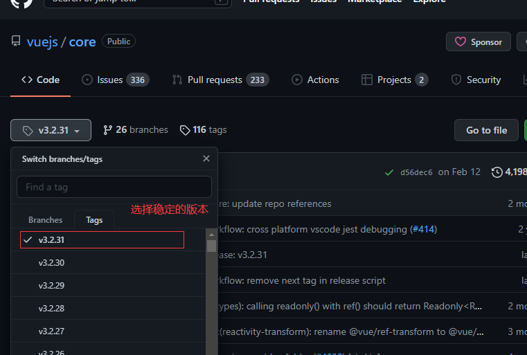
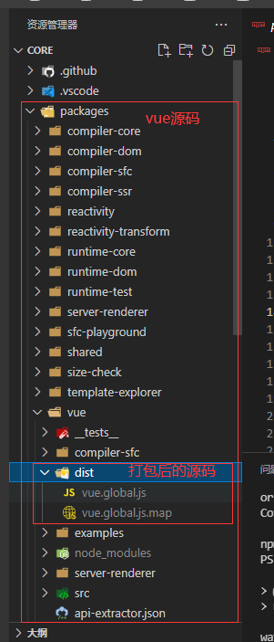
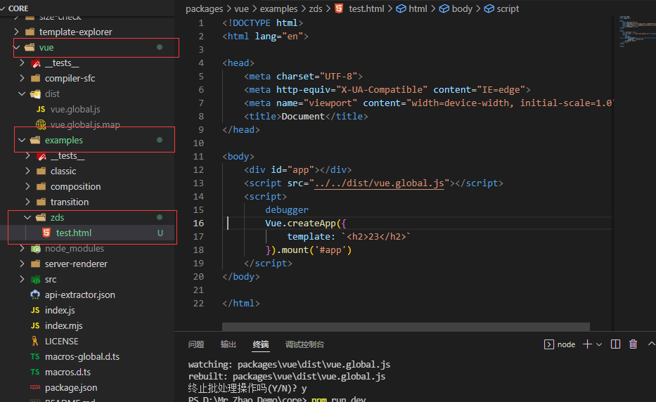
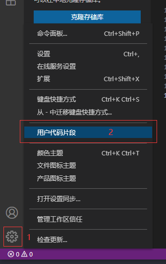
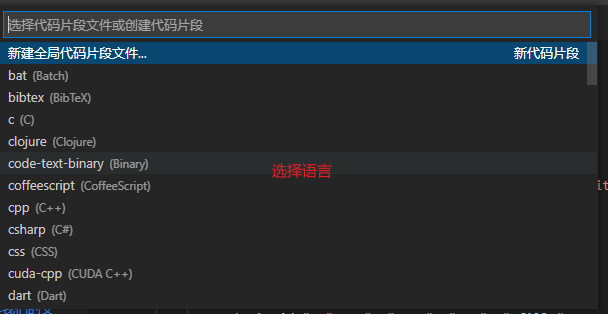
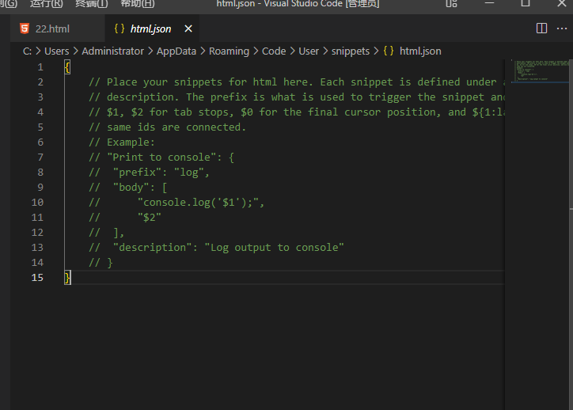
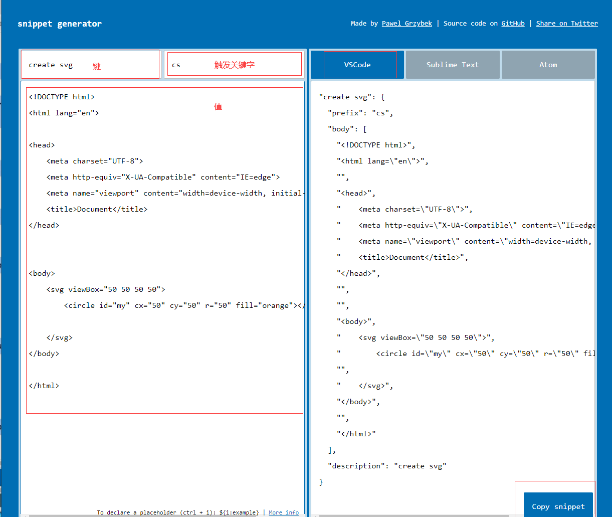
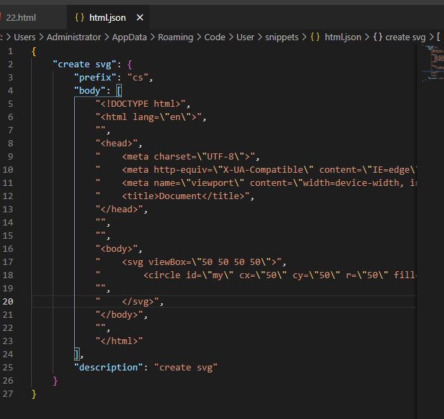
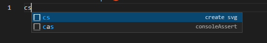

## `babel`

> `babel` 是一个`javascript`编译器,用于将高版本不兼容浏览器的语法转换成低版本适配浏览器的语法

```sh
# 局部安装 babel
npm install @babel/core @babel/cli -D
# 编译 demo.js 文件 输出到 dist 目录
npx babel demo.js --out-dir dist
```

> 安装并使用相应插件才可以转换

```sh
# 安装转换箭头函数语法的插件
npm install @babel/plugin-transform-arrow-functions -D
# 安装转换块作用域的插件
npm install @babel/plugin-transform-block-scoping
# 编译 demo.js 文件 输出到 dist 目录,并设置使用插件
npx babel demo.js --out-dir dist --plugins=@babel/plugin-transform-arrow-functions,@babel/plugin-transform-block-scoping
```

> 设置插件比较麻烦,可以使用预设

```sh
# 安装预设插件
npm install @babel/preset-env -D
# 编译 demo.js 文件 输出到 dist 目录,并设置使用预设
npx babel demo.js --out-dir dist --presets=@babel/preset-env
```

> webpack 中可以使用`babel-loader`插件来引入`babel`,然后安装插件或预设使它进行编译

### 配置文件

有两种配置文件的编写

- `babel.config.[json | js | cjs | mjs]`
- `.babelrc.[json | babelrc | js | cjs | mjs}`
  > `babel.config.json`: 可以直接作用于`Monorepos`项目的子包,更推荐

## `vue-cli`

- vue 脚手架
- `cli` 是 `Command-Line Interface`命令行界面
- 内置了`webpack`相关配置

## 分包

> 通过`import`函数导入的模块.后续`webpack`对其进行打包的时候会进行分包的操作

```js
// 它会返回一个promise
import("./utils/math").then((res) => {
  console.log(res.sum(20, 30));
});
```

```js
// webpack 会为这个组件另分一个包,懒加载
import { defineAsyncComponent } from "vue";
const AsyncCategory = defineAsyncComponent(() => import("./AsyncCategory.vue"));
```

## 动态绑定属性名称

```HTML
<template id="my-app">
    <div :[name]="value">232</div>
</template>
<script>
    const App= {
        template: '#my-app',
        data(){
            return{
                name: 'cba',
                value: 'kk'
            }
        }
    }
    Vue.createApp(App).mount('#app')
</script>
```

```html
<div cba="kk">232</div>
```

## 将对象的所有属性绑定到元素上

```HTML
<template id="my-app">
    <div v-bind="info">232</div>
</template>
<script>
    const App= {
        template: '#my-app',
        data(){
            return{
                info:{
                    name: 'zds',
                    age:18,
                    height: 1.80
                }
            }
        }
    }
    Vue.createApp(App).mount('#app')
</script>
```

```html
<div name="zds" age="18" height="1.80">232</div>
```

## 绑定多个事件

```HTML
<template id="my-app">
    <div v-on="{click: btnClick,mousemove:mouseMove}"></div>
</template>
<script>
    const App= {
        template: '#my-app',
        methods: {
            btnClick(){},
            mouseMove(){}
        }
    }
    Vue.createApp(App).mount('#app')
</script>
```

## watch 侦听对象里的指定属性

```html
<script>
  onst App = {
      data() {
          return {
              info: { name: "why", age: 10, nba: { height: 30 } }
          }
      },
      watch: {
          'info.nba.height': {
              handler(n, old) {
              console.log(n, old);
              }
          }
      }
  }
  Vue.createApp(App).mount('#app')
</script>
```

## watch 侦听对象数组里的指定属性

> 数组遍历子组件,子组件通过 props 接受数组的对象,然后在子组件中 watch 对象中的属性(同上)

## webpack-vue

> webpack 无法编译`SFC(single file component)` 单文件组件 需要安装`loader`和依赖

```sh
npm install vue-loader -D
npm install @vue/compiler-sfc -D
```

```sh
# 不询问 直接创建 package.json 文件
npm init -y
# 局部安装 webpack 和 webpack-cli 开发依赖
npm install webpack webpack-cli --save-dev
# 同上 简写
npm install webpack webpack-cli -D
```

```sh
# 在终端上敲的命令,与 cmd 一样,都是执行的全局命令
webpack
# npx 优先执行 ./node_modules/.bin/ 中的命令
npx webpack
```

```sh
"scripts":{
    "dev": "webpack"
}
# 在./node_modules/.bin/寻找并执行webpack命令
npm run dev
```

```sh
# webpack 配置文件
webpack.config.js
```

## 本地服务器

### 自动编译

#### `webpack watch mode(较少使用)`

> webpack 提供了`watch`模式,在该模式下,webpack 依赖图中的所有文件,只要有一个发生了更新,那么代码将被重新编译

开启 watch:

- 配置对象中添加`watch:true`
- 在启动 webpack 的命令中,添加`--watch`标识

> 它是监听文件的变化,但是它并没有自动刷新浏览器的功能

#### `webpack-dev-server(常用)`

> 基于`express`框架搭建的本地服务器
> 可以实时重新加载

```sh
# 安装
npm install webpack-dev-server -D
```

```json
// 启动配置
{
  "scripts": {
    "serve": "webpack serve"
  }
}
```

```sh
# 启动
npm run serve
```

编译后不会写入到任何输出文件,而是将 bundle 文件保留在内存中
事实上`webpack-dev-server`使用了一个库`memfs`

> `HMR(Hot Module Replacement)模块热替换`: 应用程序运行过程中替换,添加,删除模块,无需重新刷新整个页面

```js
// 开启HMR
target: "web",
devServer: {
    ...
    hot: true
}
```

> 不开启`HMR`,修改源代码之后,整个页面会自动刷新,使用的是`live reloading`

开启 HMR 之后,修改某一个模块的代码时,依然刷新整个页面,这是因为需要指定哪些模块发生更新时,进行 HMR

```js
// webpack.config.js
if (module.hot) {
  // 哪个模块需要开启就引入哪个
  module.hot.accept("./util.js", () => {
    console.log(111);
  });
}
// 安装vue-loader 就不需要指定模块了 因为它已经帮我们做了这个工作
```

#### `webpack-dev-middleware`

## 如何跑 vue3 源码



```js
// vue3项目指定pnpm为包管理器,全局安装
npm install pnpm -g
// 运行,会将打包后的源码输出到packages->vue->dist目录下
npm run dev
```



> 创建自己的示例文件夹,就可以`debugger`了



## 为`vscode`添加代码片段







