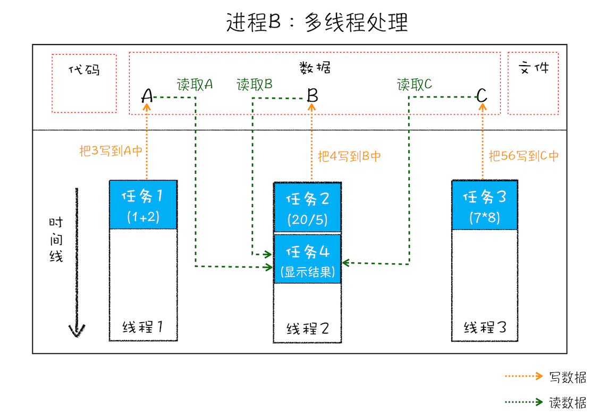

## 进程和线程

- `并行处理:` 同一时刻处理多个任务
- `单线程:` 按照顺序执行任务,同一时刻处理一个任务
- `多线程:` 可以并行处理任务
- `线程:` 是不能单独存在的,由`进程`启动和管理
- `进程:` 是一个程序的运行实例,启动一个程序的时候,操作系统会为该程序创建一块内存,用来存放代码,运行中的数据和一个执行任务的主线程,我们把这样的一个运行环境叫`进程`

> 线程依附于进程,而进程使用多线程并行处理提升运算效率

进程和线程之间的关系有` 4 `个特点:

1. 进程中的任意一线程执行出错,都会导致整个进程崩溃
2. 线程之间共享进程中的数据

> 线程 1,2,3 分别把执行结果写入 A,B,C 中,然后线程 2 继续从 A,B,C 中读取数据,用来显示执行结果

3. 当一个进程关闭后,操作系统会回收进程所占用的内存
4. 进程之间的内容相互隔离
   > 如果进程需要进行数据的通信,可以使用用于进程间通信的`IPC`机制

## 单进程浏览器时代

单进程浏览器是指浏览器的所有功能模块都运行在同一个进程里,这些模块包含了`网络,插件,JavaScript 运行环境,渲染引擎和页面`等,早在 `2007` 年之前, 市面上浏览器都是单进程的

> 单进程浏览器架构示意图

如此多的功能模块运行在一个进程里,是导致单进程浏览器`不稳定`,`不流畅`和`不安全`的一个主要因素

### 问题一: 不稳定

早期浏览器需要借助于插件来实现诸如`Web`视频、`Web` 游戏等各种强大的功能，但是插件是最容易出问题的模块，并且还运行在浏览器进程之中，所以一个插件的意外崩溃会引起整个浏览器的崩溃。
除了插件之外，渲染引擎模块也是不稳定的，通常一些复杂的 `JavaScript` 代码就有可能引起渲染引擎模块的崩溃。和插件一样，渲染引擎的崩溃也会导致整个浏览器的崩溃。

### 问题二: 不流畅

所有页面的渲染模块、`JavaScript` 执行环境以及插件都是运行在同一个线程中的，这就意味着同一时刻只能有一个模块可以执行,此外,`脚本(比如:while(1){...},无线循环),插件,页面内存泄漏`也是单进程变慢的重要原因

### 问题三: 不安全

- 插件可以使用` C/C++ `等代码编写，通过插件可以获取到操作系统的任意资源。如果是个恶意插件，那么它就可以释放病毒、窃取你的账号密码，引发安全性问题。
- 页面脚本可以通过浏览器的漏洞来获取系统权限，这些脚本获取系统权限之后也可以对你的电脑做一些恶意的事情，同样也会引发安全问题。

## 多进程浏览器时代

> `2008 `年 `Chrome `发布时的进程架构
>` Chrome `的页面是运行在单独的渲染进程中的,同时页面里的插件也是运行在单独的插件进程之中,而进程之间是通过` IPC` 机制进行通信的

### 解决问题一: 不稳定

由于进程之间相互隔离,当一个页面或者插件崩溃,影响的仅仅是当前页面进程或插件进程,不会影响到浏览器和其他页面

### 解决问题二: 不流畅

- ` JavaScript` 运行在渲染进程中,当它阻塞了渲染进程,影响的也只是当前的渲染页面,不会影响到浏览器和其他页面
- 当关闭一个页面时,整个渲染进程也会被关闭,该进程所占用的内存都会被系统回收,解决了浏览器页面内存泄漏的问题

### 解决问题三: 不安全

采用多进程架构的额外好处是可以使用安全沙箱，可以把沙箱看成是操作系统给进程上了一把锁，沙箱里面的程序可以运行，但是不能在你的硬盘上写入任何数据，也不能在敏感位置读取任何数据。`Chrome`把插件进程和渲染进程锁在沙箱里面，这样即使在渲染进程或者插件进程里面执行了恶意程序，恶意程序也无法突破沙箱去获取系统权限。

## 目前多进程架构

最新的 `Chrome` 浏览器包括:

- **浏览器主进程**: 负责界面显示,用户交互,子进程管理,存储等功能
- **GPU 进程**: `Chrome` 刚开始发布的时候是没有`GPU` 进程的。而它初衷是为了实现`3D CSS` 的效果，只是随后网页、`Chrome` 的 `UI` 界面都选择采用`GPU`来绘制，这使得 `GPU`成为浏览器普遍的需求。最后，`Chrome` 在其多进程架构上也引入了 `GPU` 进程。
- **网络进程**: 负责页面的网络资源加载，之前是作为一个模块运行在浏览器进程里面的，直至最近才独立出来，成为一个单独的进程。
- **多个渲染进程**: 核心任务是将 `HTML`、`CSS` 和 `JavaScript` 转换为用户可以与之交互的网页，排版引擎 `Blink`和 `JavaScript` 引擎 `V8` 都是运行在该进程中，默认情况下，`Chrome` 会为每个 `Tab`标签创建一个渲染进程。出于安全考虑，渲染进程都是运行在沙箱模式下。
- **多个插件进程**: 负责插件的运行，因插件易崩溃，所以需要通过插件进程来隔离，以保证插件进程崩溃不会对浏览器和页面造成影响。

多进程模型带来的问题:

- **更高的资源占用** : 因为每个进程都会包含公共基础结构的副本（如 JavaScript 运行环境），这就意味着浏览器会消耗更多的内存资源。
- **更复杂的体系结构**: 浏览器各模块之间耦合性高、扩展性差等问题，会导致现在的架构已经很难适应新的需求了。

## 未来面向服务的架构

为了解决这些问题，在 `2016` 年，`Chrome` 官方团队使用`面向服务的架构`（`Services Oriented Architecture`，简称 `SOA`）的思想设计了新的 Chrome 架构。也就是说 `Chrome` 整体架构会朝向现代操作系统所采用的“面向服务的架构” 方向发展，原来的各种模块会被重构成独立的服务（`Service`），每个服务（`Service`）都可以在独立的进程中运行，访问服务（`Service`）必须使用定义好的接口，通过 `IPC` 来通信，从而构建一个更内聚、松耦合、易于维护和扩展的系统，更好实现 `Chrome` 简单、稳定、高速、安全的目标。

> `Chrome`最终要把 UI、数据库、文件、设备、网络等模块重构为基础服务，类似操作系统底层服务，下面是`Chrome 面向服务的架构`的进程模型图：

`Chrome`正在逐步构建 `Chrome` 基础服务（`Chrome Foundation Service`），如果你认为` Chrome` 是“便携式操作系统”，那么 `Chrome` 基础服务便可以被视为该操作系统的“基础”系统服务层。

同时 `Chrome` 还提供灵活的弹性架构，在强大性能设备上会以多进程的方式运行基础服务，但是如果在资源受限的设备上（如下图），`Chrome `会将很多服务整合到一个进程中，从而节省内存占用。

