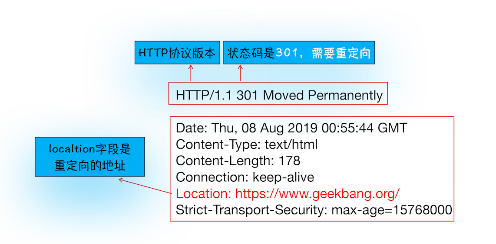
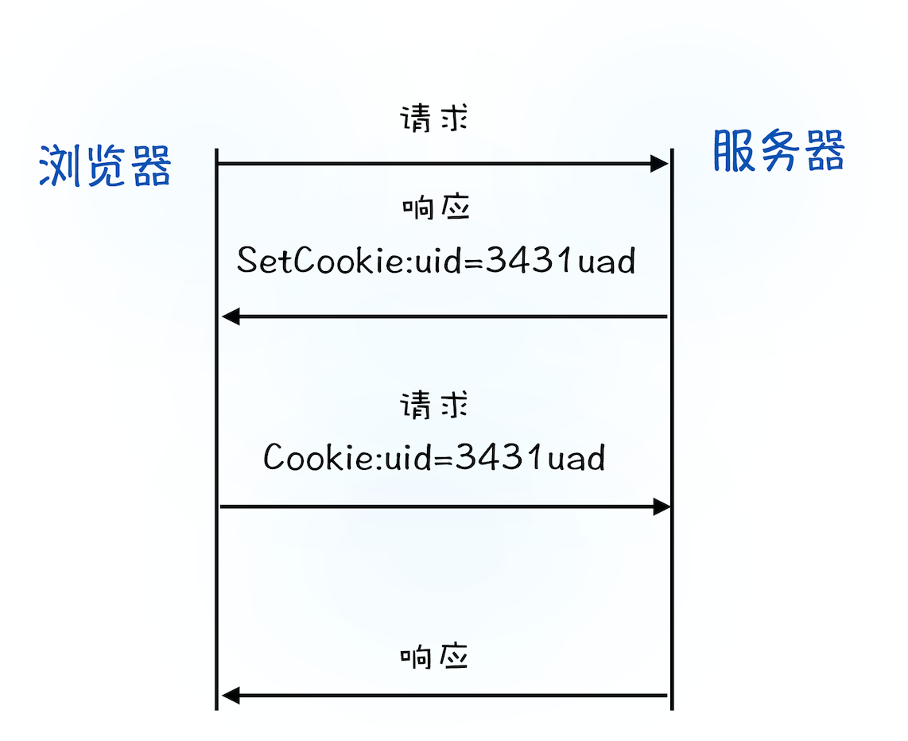

`HTTP` 协议，建立在 `TCP` 连接基础之上。`HTTP` 是一种允许浏览器向服务器获取资源的协议，是`Web`的基础，通常由浏览器发起请求，用来获取不同类型的文件，例如`HTML`文件、`CSS` 文件、`JavaScript`文件、图片、视频等。此外，`HTTP`也是浏览器使用最广的协议，所以要想学好浏览器，就要先深入了解 `HTTP`。

## 浏览器端发起 `HTTP` 请求流程

浏览器地址栏里键入`https://www.baidu.com/`,浏览器会完成哪些动作呢?

> `https`: 协议类型
> `//` : 层级 URL 标记符号
> `www.baidu.com` : 域名

### 1. 构建请求

首先，浏览器构建请求行信息（如下所示），构建好后，浏览器准备发起网络请求。

```
GET /index.html HTTP1.1
```

### 2. 查找缓存

在真正发起网络请求之前，浏览器会先在浏览器缓存中查询是否有要请求的文件。其中，浏览器缓存是一种在本地保存资源副本，以供下次请求时直接使用的技术。
当浏览器发现请求的资源已经在浏览器缓存中存有副本，它会拦截请求，返回该资源的副本，并直接结束请求，而不会再去源服务器重新下载。这样做的好处有：

- 缓解服务器端压力，提升性能（获取资源的耗时更短了）
- 对于网站来说，缓存是实现快速资源加载的重要组成部分

如果缓存查找失败，就会进入网络请求过程了。

### 3. 准备 `IP` 地址和端口

因为浏览器使用`HTTP` 协议作为应用层协议，用来封装请求的文本信息；并使用`TCP/IP` 作传输层协议将它发到网络上，所以在 `HTTP`工作开始之前，浏览器需要通过 `TCP`与服务器建立连接。也就是说`HTTP`的内容是通过`TCP`的传输数据阶段来实现的，可以结合下图更好地理解这二者的关系。


数据包都是通过`IP`地址传输给接收方的。由于 `IP` 地址是数字标识，难以记忆，但使用域名（`www.baidu.com`）就好记多了，所以基于这个需求又出现了一个服务，负责把域名和`IP`地址做一一映射关系。这套域名映射为 `IP`的系统就叫做**域名系统**，简称`DNS`（`Domain Name System`）。

浏览器首先会请求 `DNS`返回域名对应的`IP`。浏览器还提供了`DNS`数据缓存服务，如果某个域名已经解析过，就会缓存解析的结果，以供下次查询时直接使用，这样也会减少一次网络请求。

拿到 `IP` 之后，接下来就需要获取端口号了。通常情况下，如果`URL` 没有特别指明端口号，那么 `HTTP` 协议默认是`80` 端口。

### 4. 等待`TCP` 队列

`IP`地址和端口都准备好了，还不能建立 `TCP` 连接,因为`Chrome`有个机制，同一个域名同时最多只能建立 `6`个 `TCP` 连接，如果在同一个域名下同时有`10`个请求发生，那么其中`4`个请求会进入排队等待状态，直至进行中的请求完成。如果当前请求数量少于 `6`，会直接进入下一步，建立`TCP` 连接。

### 5. 建立`TCP`连接

排队等待结束之后， `HTTP`工作开始之前，浏览器通过`TCP`与服务器三次握手建立连接

### 6. 发送 `HTTP` 请求

一旦建立了`TCP` 连接，浏览器就可以和服务器进行通信了。而 `HTTP`中的数据正是在这个通信过程中传输的。

可以结合下图来理解，浏览器是如何发送请求信息给服务器的。


首先浏览器会向服务器发送请求行，它包括了:

- **请求方法**
- **请求 `URI`**（`Uniform Resource Identifier`）
- **`HTTP` 版本协议**。

发送请求行，就是告诉服务器浏览器需要什么资源，最常用的请求方法是`Get`

另外一个常用的请求方法是`POST`，用于发送一些数据给服务器，通过请求体来发送。

在浏览器发送请求行命令之后，还要以请求头形式把浏览器的一些基础信息告诉服务器。比如:

- **浏览器所使用的操作系统**
- **浏览器内核等信息**
- **当前请求的域名信息**
- **浏览器端的 `Cookie` 信息**
- **...**

## 服务器端处理 `HTTP` 请求流程

`HTTP`的请求信息被送达了服务器。服务器会根据浏览器的请求信息来准备相应的内容。

### 1. 返回请求

通过工具软件 `curl`来查看返回请求数据

> windows 内置了`curl`

```
curl -i  https:/www.baidu.com/
```


首先服务器会返回响应行，包括:

- **协议版本**
- **状态码**

并不是所有的请求都可以被服务器处理，一些无法处理或者处理出错的信息,服务器会通过请求行的状态码来告诉浏览器它的处理结果

- **状态码`200`** 表示处理成功
- **状态码`404`** 表示没有找到页面

随后，正如浏览器会随同请求发送请求头一样，服务器也会随同响应向浏览器发送响应头。响应头包含了:服务器自身的一些信息，比如服务器生成返回数据的时间、返回的数据类型（`JSON`、`HTML`、流媒体等类型），以及服务器要在客户端保存的 `Cookie` 等信息。

发送完响应头后，服务器就可以继续发送响应体的数据，通常，响应体就包含了`HTML`的实际内容。

### 2. 断开连接

通常情况下，一旦服务器向客户端返回了请求数据，它就要关闭 `TCP` 连接。不过如果浏览器或者服务器在其头信息中加入了：

```
Connection:Keep-Alive

```

那么`TCP` 连接在发送后将仍然保持打开状态，这样浏览器就可以继续通过同一个 `TCP` 连接发送请求。保持 `TCP` 连接可以省去下次请求时需要建立连接的时间，提升资源加载速度。比如，一个 `Web`页面中内嵌的图片就都来自同一个`Web` 站点，如果初始化了一个持久连接，就可以复用该连接，以请求其他资源，而不需要重新再建立新的 `TCP` 连接。

### 3. 重定向

当你在浏览器中访问一个网址，发现最终打开的页面地址与之不同,说明出现了重定向操作

```
curl -I geekbang.org
```

> -I 表示只需要获取响应头和响应行数据



响应行返回的状态码是 `301`，表示告诉浏览器，需要重定向到另外一个网址，而需要重定向的网址正是包含在响应头的 `Location` 字段中，接下来，浏览器获取 Location 字段中的地址，并使用该地址重新导航

不过也不要认为这种跳转是必然的。如果你打开 `https://12306.cn`，你会发现这个站点是打不开的。这是因为 `12306`的服务器并没有处理跳转，所以必须要手动输入完整的`https://www.12306.com`才能打开页面。

## 问题解答

### 1. 为什么很多站点第二次打开速度会很快？

如果第二次页面打开很快，主要原因是第一次加载页面过程中，缓存了一些耗时的数据。

**`DNS`缓存**和**页面资源缓存**这两块数据是会被浏览器缓存的。`DNS`缓存主要是在浏览器本地把对应的 `IP` 和域名关联起来

重点看下浏览器资源缓存，下面是缓存处理的过程：


当服务器返回`HTTP`响应头给浏览器时，浏览器是通过响应头中的`Cache-Control` 字段来设置是否缓存该资源。通常，我们还需要为这个资源设置一个缓存过期时长，而这个时长是通过 `Cache-Control` 中的 `Max-age` 参数来设置的，比如上图设置的缓存过期时间是 `2000` 秒。

```
Cache-Control:Max-age=2000
```

在该缓存资源还未过期的情况下, 如果再次请求该资源，会直接返回缓存中的资源给浏览器。

如果缓存过期了，浏览器则会继续发起网络请求，并且在`HTTP`请求头中带上：

```
If-None-Match:"4f80f-13c-3a1xb12a"
```

服务器收到请求头后，会根据 `If-None-Match` 的值来判断请求的资源是否有更新。

- 如果没有更新，返回 `304` 状态码，相当于服务器告诉浏览器：“这个缓存可以继续使用，这次就不重复发送数据给你了。”
- 如果资源有更新，服务器就直接返回最新资源给浏览器。

### 2. 登录状态是如何保持的？

- 用户填入用户名和密码，点击登录。提交用户登录信息给服务器。
- 服务器接收到浏览器提交的信息之后，验证用户登录信息，生成表示用户身份的字符串，并把它写到响应头的`Set-Cookie`字段里，然后把响应头发送给浏览器。

```
Set-Cookie: UID=3431uad;
```

- 浏览器接收到服务器的响应头后，解析响应头，将 `Set-Cookie`字段的情况，保存到本地。
- 当用户再次访问时，浏览器会在发起请求之前，读取`Cookie`数据，把数据写进请求头里的`Cookie`字段里（如下所示），然后浏览器再将请求头发送给服务器

```
Cookie: UID=3431uad;
```

- 服务器在收到 `HTTP`请求头数据之后，查找请求头里面的`Cookie`字段信息，服务器查询后台，判断该用户是已登录状态，然后生成含有该用户信息的页面数据发送给浏览器。
- 浏览器在接收到该含有当前用户的页面数据后，就可以正确展示用户登录的状态信息了。

浏览器页面状态是通过使用`Cookie`来实现的。`Cookie`流程可以参考下图：



详细的`HTTP`请求示意图

