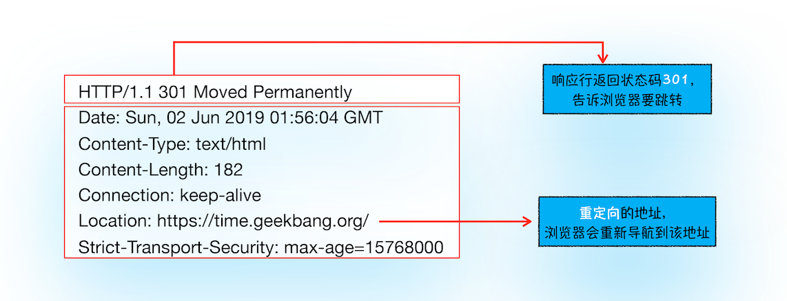
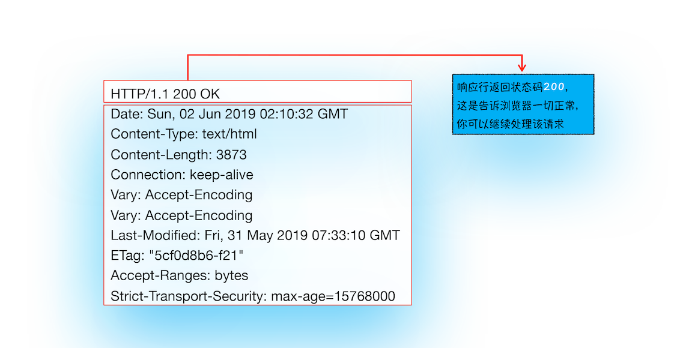
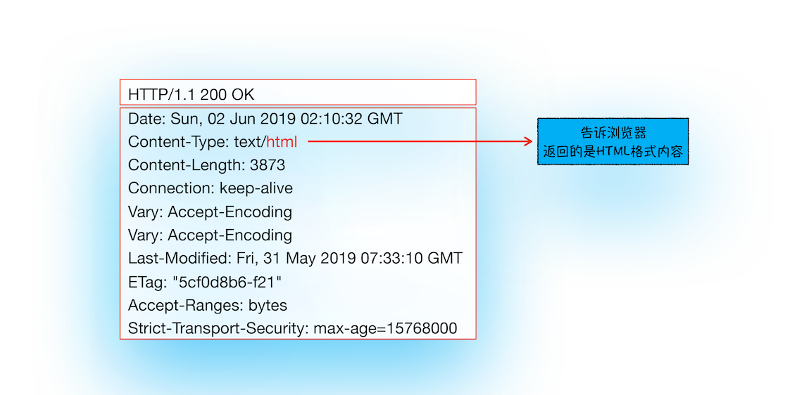
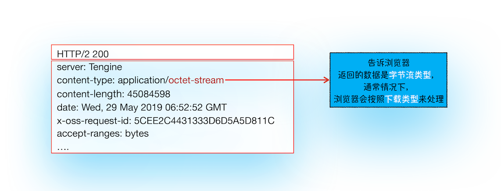

> 从输入 `URL`到页面展示完整流程示意图


- **浏览器进程**主要负责用户交互、子进程管理和文件储存等功能。
- **网络进程**是面向渲染进程和浏览器进程等提供网络下载功能。
- **渲染进程**的主要职责是把从网络下载的 `HTML`、`JavaScript`、`CSS`、图片等资源解析为可以显示和交互的页面。因为渲染进程所有的内容都是通过网络获取的，会存在一些恶意代码利用浏览器漏洞对系统进行攻击，所以运行在渲染进程里面的代码是不被信任的。这也是为什么`Chrome`会让渲染进程运行在安全沙箱里，就是为了保证系统的安全。

1. 用户从**浏览器进程**里输入请求信息
2. **网络进程**发起 `URL`请求
3. 服务器响应 `URL` 请求之后，**浏览器进程**开始准备**渲染进程**
4. **渲染进程**准备好之后，需要先向**渲染进程**提交页面数据，我们称之为**提交文档**阶段
5. **渲染进程**接收完文档信息之后，便开始解析页面和加载子资源，完成页面的渲染

用户发出`URL`请求到页面开始解析的这个过程，就叫做**导航**

## 从输入 URL 到页面展示

### 1. 用户输入

当用户在地址栏中输入一个查询关键字时，地址栏会判断输入的关键字是搜索内容，还是请求的 `URL`。

- 如果是搜索内容，地址栏会使用浏览器默认的搜索引擎，来合成新的带搜索关键字的 `URL`。
- 如果判断输入内容符合 `URL` 规则，那么地址栏会根据规则，把这段内容加上协议，合成为完整的`URL`

当用户输入关键字并键入回车之后，浏览器便进入加载状态,但页面显示的依然是之前打开的页面内容，这是因为需要等待提交文档阶段，页面内容才会被替换。

### 2. `URL`请求过程

浏览器进程会通过进程间通信（`IPC`）把`URL` 请求发送至网络进程，网络进程接收到 `URL` 请求后，会在这里发起真正的 `URL` 请求流程。

首先，网络进程会查找本地缓存是否缓存了该资源。如果有缓存资源，那么直接返回资源给浏览器进程；如果在缓存中没有查找到资源，那么直接进入网络请求流程。这请求前的第一步是要进行 `DNS`解析，以获取请求域名的服务器 `IP`地址。如果请求协议是 `HTTPS`，那么还需要建立 `TLS`连接。

接下来就是利用 `IP` 地址和服务器建立`TCP`连接。连接建立之后，浏览器端会构建请求行、请求头等信息，并把和该域名相关的 `Cookie` 等数据附加到请求头中，然后向服务器发送构建的请求信息。

服务器接收到请求信息后，会根据请求信息生成响应数据（包括响应行、响应头和响应体等信息），并发给网络进程。等网络进程接收了响应行和响应头之后，就开始解析响应头的内容了。（为了方便讲述，下面我将服务器返回的响应头和响应行统称为响应头。）

#### （1）重定向

在接收到服务器返回的响应头后，网络进程开始解析响应头，如果发现返回的状态码是`301`或者 `302`，那么说明服务器需要浏览器重定向到其他 `URL`。这时网络进程会从响应头的 `Location`字段里面读取重定向的地址，然后再发起新的 `HTTP`或者 `HTTPS`请求

比如，我们在终端里输入以下命令：

```
curl -I http://time.geekbang.org/
```



```
curl -I https://time.geekbang.org/
```



#### （2）响应数据类型处理

`URL` 请求的数据类型，有时候是一个下载类型，有时候是正常的 `HTML` 页面，`HTTP`头中的`Content-Type` 字段会告诉浏览器,服务器返回的响应体数据是什么类型，然后根据它的值来决定如何显示响应体的内容。

```
curl -I https://time.geekbang.org/
```



```
curl -I https://res001.geekbang.org/apps/geektime/android/2.3.1/official/geektime_2.3.1_20190527-2136_offical.apk
```



如果`Content-Type` 字段的值被浏览器判断为下载类型，那么该请求会被提交给浏览器的下载管理器，同时该 `URL` 请求的导航流程就此结束。但如果是`HTML`，那么浏览器则会继续进行导航流程。

### 3. 准备渲染进程

同一站点（`same-site`）: 根域名+协议+该根域名下的所有子域名和不同的端口

```
https://time.geekbang.org
https://www.geekbang.org
https://www.geekbang.org:8080
```

它们都是属于同一站点，因为它们的协议都是 `HTTPS`，而且根域名也都是 `geekbang.org`。

`Chrome` 的默认策略是，每个标签对应一个渲染进程。但如果从一个页面打开了另一个新页面，而新页面和当前页面属于同一站点的话，那么新页面会复用父页面的渲染进程。官方把这个默认策略叫 `process-per-site-instance`。

渲染进程准备好之后，还不能立即进入文档解析状态，因为此时的文档数据还在网络进程中，并没有提交给渲染进程，所以下一步就进入了提交文档阶段。

### 4. 提交文档

> 这里的**文档**是指`URL`请求的响应体数据。

- **浏览器进程**向**渲染进程**发出**提交文档**的消息，**渲染进程**会和**网络进程**建立传输数据的**管道**。
- 数据传输完成之后，**渲染进程**向**浏览器进程**发出**确认提交**的消息。
- **浏览器进程**收到消息后，更新浏览器界面状态，包括了安全状态、地址栏的 `URL`、前进后退的历史状态，并更新`Web` 页面。

> 还没渲染,只是更新页面,应该是空白的

这就是一个完整的导航流程，之后就要进入渲染阶段了。

### 5. 渲染阶段

渲染进程开始页面解析和子资源加载。页面生成后，渲染进程会发送一个消息给浏览器进程，浏览器接收到消息后，会停止标签图标上的加载动画
