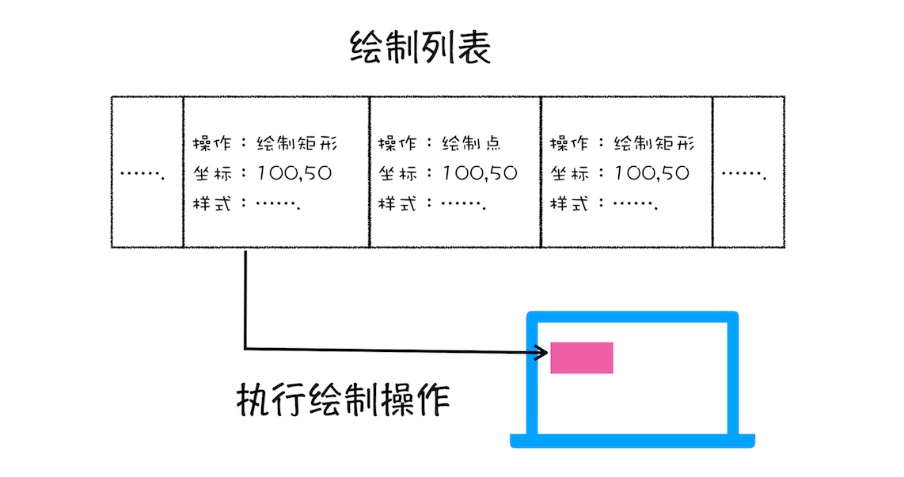
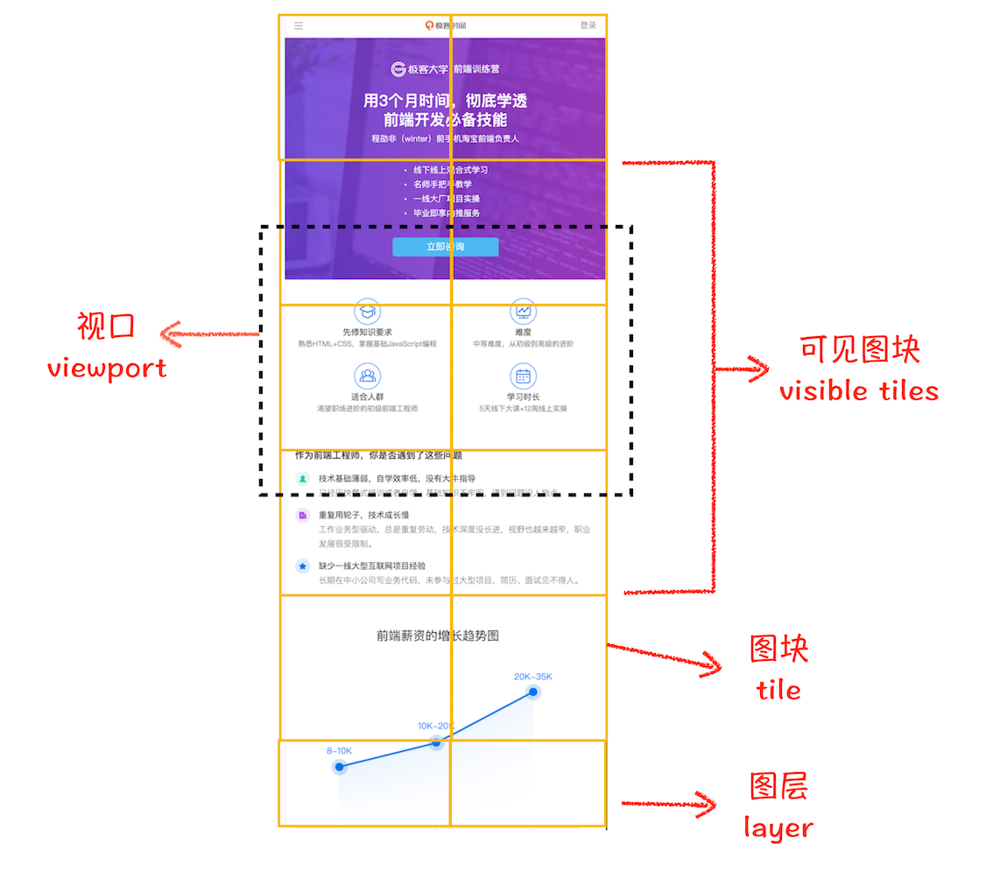

渲染模块在执行过程中会被划分为很多子阶段，输入的 `HTML`经过这些子阶段，最后输出像素。我们把这样的一个处理流程叫做`渲染流水线`


按照渲染的时间顺序，流水线可分为如下几个子阶段：

- 构建 `DOM`树
- 样式计算(`Recalculate Style`)
- 布局阶段
- 分层
- 绘制
- 分块
- 光栅化
- 合成

每个阶段都需要关注三点内容:

- **输入的内容**
- **处理过程**
- **输出内容**

## 构建 `DOM`树

浏览器无法直接理解和使用 `HTML`，所以需要将`HTML` 转换为浏览器能够理解的结构——`DOM` 树。

> 树结构


树结构中每个点我们称为`节点`，相连的节点称为`父子节点`。


构建 `DOM`树的输入内容是一个非常简单的 `HTML` 文件，然后经由 `HTML` 解析器解析，最终输出树状结构的`DOM`。

> 控制台里面输入`document`能看到一个完整的 `DOM`树结构


`DOM` 和`HTML`内容几乎是一样的，但是和`HTML` 不同的是，`DOM` 是保存在内存中树状结构，可以通过`JavaScript` 来查询或修改其内容。

## 样式计算

样式计算的目的是为了计算出 `DOM` 节点中每个元素的具体样式，这个阶段大体可分为三步来完成。

### 1. 把 `CSS` 转换为浏览器能够理解的结构

浏览器无法直接理解这些纯文本的 `CSS`样式，所以当渲染引擎接收到 `CSS`文本时，会执行一个转换操作，将`CSS`文本转换为浏览器可以理解的结构—`styleSheets`。并且该结构同时具备了查询和修改功能

> `document.styleSheets`可以查看其结构


### 2. 转换样式表中的属性值，使其标准化

```css
body {
  font-size: 2em;
}
p {
  color: blue;
}
span {
  display: none;
}
div {
  font-weight: bold;
}
div p {
  color: green;
}
div {
  color: red;
}
```

上面的`CSS` 文本中有很多属性值，如 `2em`、`blue`、`bold`，这些类型数值不容易被渲染引擎理解，所以需要将所有值转换为渲染引擎容易理解的、标准化的计算值，这个过程就是**属性值标准化**。


### 3. 计算出 `DOM` 树中每个节点的具体样式

根据`CSS` 的继承规则和层叠规则计算

- **继承规则**就是每个`DOM`节点都包含有父节点的样式


- **层叠规则**是一个定义了如何合并来自多个源的属性值的算法。

这个阶段最终输出的内容是每个 `DOM`节点的样式，并被保存在`ComputedStyle`的结构内。


## 布局阶段

算出 `DOM`树中可见元素的几何位置，我们把这个计算过程叫做布局。

`Chrome` 在布局阶段需要完成两个任务：创建布局树和布局计算。

### 1. 创建布局树

`DOM`树含有很多不可见的元素，比如 `head` 标签，还有使用了 `display:none` 属性的元素。所以在显示之前，我们还要额外地构建一棵只包含可见元素布局树。

> 只包含可见元素布局树


浏览器大体上完成了下面这些工作：

- 遍历 `DOM` 树中的所有可见节点，并把这些节点加到布局中
- 不可见的节点会被布局树忽略掉

### 2. 布局计算

在执行布局操作的时候，会把布局运算的结果重新写回布局树中，所以布局树既是输入内容也是输出内容，这是布局阶段一个不合理的地方，因为在布局阶段并没有清晰地将输入内容和输出内容区分开来。针对这个问题，`Chrome` 团队正在重构布局代码，下一代布局系统叫 `LayoutNG`，试图更清晰地分离输入和输出，从而让新设计的布局算法更加简单。

## 分层

渲染引擎为特定的节点生成专用的图层，并生成一棵对应的图层树（`LayerTree`）

> `Chrome`开发者工具选择`Layers`标签，可以查看可视化页面的分层情况

渲染引擎给页面分了很多图层，这些图层按照一定顺序叠加在一起,就形成了最终的页面

> 图层和布局树节点之间的关系


并不是布局树的每个节点都包含一个图层，如果一个节点没有对应的层，那么这个节点就从属于父节点的图层。每一个节点都会直接或者间接地从属于一个层。

渲染引擎会为特定的节点创建新的层,通常满足下面两点中任意一点的元素就可以被提升为单独的一个图层。

### 拥有层叠上下文属性的元素会被提升为单独的一层

页面是个二维平面，但是层叠上下文能够让 `HTML`元素具有三维概念，这些 `HTML` 元素按照自身属性的优先级分布在垂直于这个二维平面的 `z`轴上


明确定位属性的元素、定义透明属性的元素、使用 CSS 滤镜的元素等，都拥有层叠上下文属性。

### 需要剪裁（`clip`）的地方也会被创建为图层

```html
<style>
  div {
    width: 200;
    height: 200;
    overflow: auto;
    background: gray;
  }
</style>
<body>
  <div>
    <p>
      所以元素有了层叠上下文的属性或者需要被剪裁，那么就会被提升成为单独一层，你可以参看下图：
    </p>
    <p>
      从上图我们可以看到，document 层上有 A 和 B 层，而 B
      层之上又有两个图层。这些图层组织在一起也是一颗树状结构。
    </p>
    <p>
      图层树是基于布局树来创建的，为了找出哪些元素需要在哪些层中，渲染引擎会遍历布局树来创建层树（Update
      LayerTree）。
    </p>
  </div>
</body>
```

出现这种裁剪情况的时候，渲染引擎会为文字部分单独创建一个层，如果出现滚动条，滚动条也会被提升为单独的层。

## 图层绘制

试想一下，如果给你一张纸，让你先把纸的背景涂成蓝色，然后在中间位置画一个红色的圆，最后再在圆上画个绿色三角形。你会怎么操作呢？

通常，你会把你的绘制操作分解为三步：

- 绘制蓝色背景；
- 在中间绘制一个红色的圆；
- 再在圆上绘制绿色三角形。

渲染引擎实现图层的绘制与之类似，会把一个图层的绘制拆分成很多小的绘制指令，然后再把这些指令按照顺序组成一个待绘制列表，如下图所示：


从图中可以看出，绘制列表中的指令其实非常简单，就是让其执行一个简单的绘制操作，比如绘制粉色矩形或者黑色的线等。而绘制一个元素通常需要好几条绘制指令，因为每个元素的背景、前景、边框都需要单独的指令去绘制。所以在图层绘制阶段，输出的内容就是这些待绘制列表。

> 打开`Layers`标签，选择`document`层，来实际体验下绘制列表，如下图所示：


> 区域 1 就是 `document` 的绘制列表，拖动区域 2 中的进度条可以重现列表的绘制过程。

## 栅格化（raster）操作

绘制列表只是用来记录绘制顺序和绘制指令的列表，而实际上绘制操作是由渲染引擎中的合成线程来完成的。可以结合下图来看下渲染主线程和合成线程之间的关系：


当图层的绘制列表准备好之后，主线程会把该绘制列表提交（`commit`）给合成线程

通常一个页面可能很大，但是用户只能看到其中的一部分，我们把用户可以看到的这个部分叫做视口（`viewport`）。


在有些情况下，有的图层可以很大，比如有的页面使用滚动条要滚动好久才能滚动到底部，但是通过视口，用户只能看到页面的很小一部分，所以在这种情况下，要绘制出所有图层内容的话，就会产生太大的开销，而且也没有必要。基于这个原因，合成线程会将图层划分为图块（`tile`），这些图块的大小通常是 `256x256` 或者 `512x512`，如下图所示：


合成线程会按照视口附近的图块来优先生成位图，实际生成位图的操作是由栅格化来执行的。所谓栅格化，是指将图块转换为位图。而图块是栅格化执行的最小单位。渲染进程维护了一个栅格化的线程池，所有的图块栅格化都是在线程池内执行的，运行方式如下图所示：


通常，栅格化过程都会使用`GPU`来加速生成，使用 `GPU` 生成位图的过程叫快速栅格化，或者 `GPU`栅格化，生成的位图被保存在`GPU`内存中。

`GPU`操作是运行在`GPU`进程中，如果栅格化操作使用了 `GPU`，那么最终生成位图的操作是在 `GPU` 中完成的，这就涉及到了跨进程操作。具体形式你可以参考下图：

渲染进程把生成图块的指令发送给`GPU`，然后在`GPU`中执行生成图块的位图，并保存在 `GPU` 的内存中。

## 合成和显示

一旦所有图块都被光栅化，合成线程就会生成一个绘制图块的命令——`DrawQuad`，然后将该命令提交给浏览器进程。
浏览器进程里面有一个叫 `viz` 的组件，用来接收合成线程发过来的 `DrawQuad` 命令，然后根据 `DrawQuad` 命令，将其页面内容绘制到内存中，最后再将内存显示在屏幕上。

## 渲染流水线大总结


1. 渲染进程将 `HTML` 内容转换为能够读懂的`DOM` 树结构。
2. 渲染引擎将 `CSS` 样式表转化为浏览器可以理解的
   `styleSheets`，计算出 `DOM` 节点的样式。
3. 创建布局树，并计算元素的布局信息。
4. 对布局树进行分层，并生成分层树。
5. 为每个图层生成绘制列表，并将其提交到合成线程。
6. 合成线程将图层分成图块，并在光栅化线程池中将图块转换成位图。
7. 成线程发送绘制图块命令`DrawQuad`给浏览器进程。
8. 浏览器进程根据 `DrawQuad` 消息生成页面，并显示到显示器上。

## 相关概念

### 更新了元素的几何属性（重排）


如果通过 `JavaScript` 或者 `CSS`修改元素的几何位置属性，例如改变元素的宽度、高度等，那么浏览器会触发重新布局，解析之后的一系列子阶段，这个过程就叫重排。无疑，重排需要更新完整的渲染流水线，所以开销也是最大的。

### 更新元素的绘制属性（重绘）


如果修改了元素的背景颜色，那么布局阶段将不会被执行，因为并没有引起几何位置的变换，所以就直接进入了绘制阶段，然后执行之后的一系列子阶段，这个过程就叫重绘。相较于重排操作，重绘省去了布局和分层阶段，所以执行效率会比重排操作要高一些。

### 直接合成阶段

如果更改一个既不要布局也不要绘制的属性，渲染引擎将跳过布局和绘制，只执行后续的合成操作，我们把这个过程叫做合成。具体流程参考下图：


在上图中，我们使用了 `CSS` 的`transform`来实现动画效果，这可以避开重排和重绘阶段，直接在非主线程上执行合成动画操作。这样的效率是最高的，因为是在非主线程上合成，并没有占用主线程的资源，另外也避开了布局和绘制两个子阶段，所以相对于重绘和重排，合成能大大提升绘制效率。

## 总结

简化遇到的问题,将复杂的问题简单化,从而最终真正解决问题
