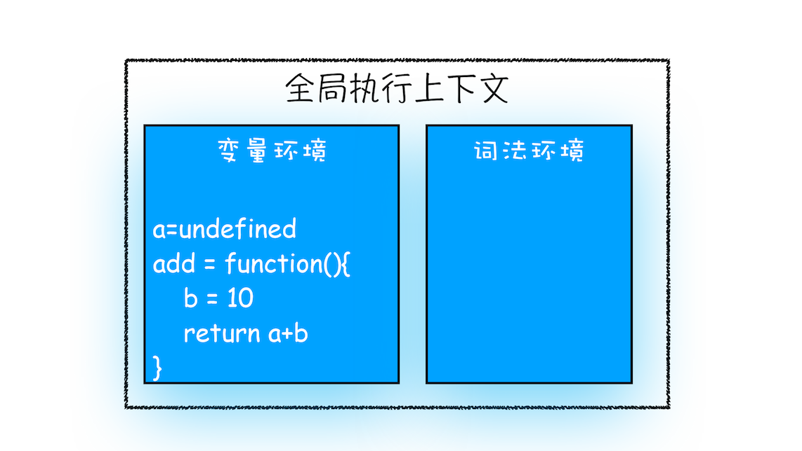
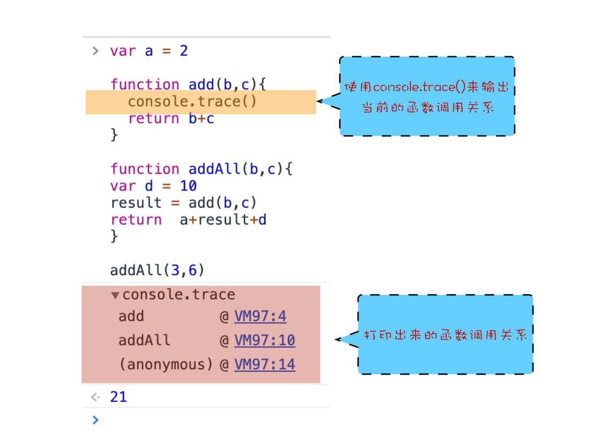

哪些情况下代码才会在执行之前就进行编译并创建执行上下文:

- 执行全局代码的时候，会创建全局执行上下文
- 调用函数的时候，会创建函数执行上下文
- `eval` 函数

调用栈是用来管理函数调用关系的一种数据结构

## 函数调用

函数调用就是运行一个函数，具体使用方式是使用函数名称跟着一对小括号

```js
var a = 2;
function add() {
  var b = 10;
  return a + b;
}
add();
```

在执行到函数`add()`之前，JavaScript 引擎会为上面这段代码创建全局执行上下文


执行上下文准备好之后，便开始执行全局代码，当执行到 `add`这儿时，`JavaScript`判断这是一个函数调用，那么将执行以下操作：

- 从全局执行上下文中，取到 `add` 函数代码。
- 对 `add` 函数里的代码进行编译，并创建该函数的执行上下文和可执行代码
- 执行代码，输出结果

`JavaScript` 引擎是通过一种叫栈的数据结构来管理执行上下文的

## 栈


## `JavaScript` 的调用栈

在执行上下文创建好后，`JavaScript`引擎会将执行上下文压入栈中，通常把这种用来管理执行上下文的栈称为执行上下文栈，又称调用栈。

调用栈是有大小的，当入栈的执行上下文超过一定数目，`JavaScript` 引擎就会报错，我们把这种错误叫做栈溢出（`Stack Overflow`）

## 浏览器技巧



