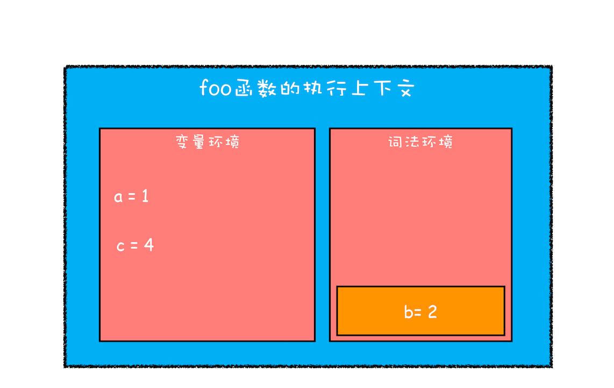

## 作用域（`scope`）

**作用域**是指在程序中定义变量的区域，该位置决定了变量的生命周期。通俗地理解，作用域就是变量与函数的可访问范围，即作用域控制着变量和函数的可见性和生命周期。

在 `ES6` 之前，`ES` 的作用域只有两种：

- **全局作用域**,代码中的任何地方都能访问，其生命周期伴随着页面的生命周期
- **函数作用域**,函数内部定义的变量或者函数，并且定义的变量或者函数只能在函数内部被访问。函数执行结束之后，函数内部定义的变量会被销毁

由于` JavaScript` 的变量提升存在着变量覆盖、变量污染等设计缺陷，所以` ES6 `引入了`let` 和 `const`关键字,从而使 `JavaScript` 拥有了**块级作用域**

## `JavaScript` 是如何支持块级作用域的

```js
function foo() {
  var a = 1;
  let b = 2;
  {
    let b = 3;
    var c = 4;
    let d = 5;
    console.log(a);
    console.log(b);
  }
  console.log(b);
  console.log(c);
  console.log(d);
}
foo();
```

### 1. 编译并创建执行上下文


- 函数内部通过`var` 声明的变量，在编译阶段全都被存放到变量环境里面了。
- 通过 `let`声明的变量，在编译阶段会被存放到词法环境（`Lexical Environment`）中。
- 函数里面的块作用域，即通过`let` 声明的变量并没有被存放到词法环境中。
- ### 2. 执行代码


在词法环境内部，维护了一个小型栈结构，栈底是函数最外层的变量，进入一个作用域块后，就会把该作用域块内部的变量压到栈顶；当作用域执行完成之后，该作用域的信息就会从栈顶弹出，这就是词法环境的结构

当执行到作用域块中的`console.log(a)`这行代码时，会沿着词法环境的栈顶向下查询，如果在词法环境中的某个块中查找到了，就直接返回给 `JavaScript`引擎，如果没有查找到，那么继续在变量环境中查找。


当作用域块执行结束之后，其内部定义的变量就会从词法环境的栈顶弹出



- **块级作用域**是通过**词法环境**的栈结构来实现
- **变量提升**是通过**变量环境**来实现

通过这两者的结合，`JavaScript` 引擎也就同时支持了**变量提升**和**块级作用域**了。