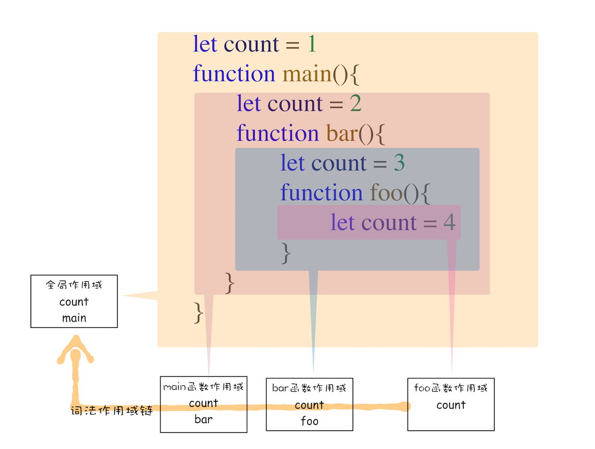

```js
function bar() {
  console.log(myName);
}
function foo() {
  var myName = " 极客邦 ";
  bar();
}
var myName = " 极客时间 ";
foo();
```


也许你的第一反应是按照调用栈的顺序来查找变量，查找方式如下：

- 先查找栈顶是否存在`myName` 变量，但是这里没有，所以接着往下查找 `foo` 函数中的变量。
- 在`foo`函数中查找到了 `myName` 变量，这时候就使用 `foo` 函数中的 `myName`。

其实这样是不对的,应该按照作用域链的规则去找

## 作用域链

在每个执行上下文的变量环境中，都包含了一个外部引用，用来指向外部的执行上下文，我们把这个外部引用称为`outer`。

当一段代码使用了一个变量时，`JavaScript` 引擎首先会在**当前的执行上下文**中查找该变量，
比如上面那段代码在查找 `myName`变量时，如果在当前的变量环境中没有查找到，那么 `JavaScript` 引擎会继续在 `outer` 所指向的执行上下文中查找


从图中可以看出，`bar`函数和 `foo` 函数的 `outer`都是指向全局上下文的，这也就意味着如果在 `bar` 函数或者 `foo`函数中使用了外部变量，那么 `JavaScript`引擎会去全局执行上下文中查找。我们把这个查找的链条就称为**作用域链**。

`foo` 函数调用的`bar` 函数，那为什么`bar` 函数的外部引用是全局执行上下文，而不是 `foo` 函数的执行上下文？
这是因为在`JavaScript`执行过程中，其作用域链是由词法作用域决定的。

## 词法作用域

词法作用域就是指作用域是由代码中函数声明的位置来决定的，所以词法作用域是静态的作用域，通过它就能够预测代码在执行过程中如何查找标识符。


词法作用域是代码阶段就决定好的，和函数是怎么调用的没有关系。

## 块级作用域中的变量查找

```js
function bar() {
  var myName = " 极客世界 ";
  let test1 = 100;
  if (1) {
    let myName = "Chrome 浏览器 ";
    console.log(test);
  }
}
function foo() {
  var myName = " 极客邦 ";
  let test = 2;
  {
    let test = 3;
    bar();
  }
}
var myName = " 极客时间 ";
let myAge = 10;
let test = 1;
foo();
```


## 闭包

```js
function foo() {
  var myName = " 极客时间 ";
  let test1 = 1;
  const test2 = 2;
  var innerBar = {
    getName: function() {
      console.log(test1);
      return myName;
    },
    setName: function(newName) {
      myName = newName;
    },
  };
  return innerBar;
}
var bar = foo();
bar.setName(" 极客邦 ");
bar.getName();
console.log(bar.getName());
```

执行到`foo` 函数内部的 `return innerBar` 这行代码时


根据词法作用域的规则，内部函数`getName`和`setName`总是可以访问它们的外部函数`foo` 中的变量

`foo`函数执行完成之后，其执行上下文从栈顶弹出了，但是由于返回的 `setName` 和 `getName`方法中使用了 `foo`函数内部的变量，所以这两个变量被保存在`foo` 函数的闭包中。而且除了 `setName` 和`getName`函数之外，其他任何地方都无法访问


在 `JavaScript` 中，根据词法作用域的规则，内部函数总是可以访问其外部函数中声明的变量，当通过调用一个外部函数返回一个内部函数后，即使该外部函数已经执行结束了，但是内部函数引用外部函数的变量依然保存在内存中，我们就把这些变量的集合称为闭包。比如外部函数是`foo`，那么这些变量的集合就称为 `foo`函数的闭包。

当执行到 `bar.setName` 方法中的`myName = "极客邦"`这句代码时，`JavaScript`引擎会沿着`当前执行上下文–>foo 函数闭包–> 全局执行上下文`的顺序来查找`myName` 变量


当调用 `bar.getName` 的时候，右边 `Scope` 项就体现出了作用域链的情况：`Local`就是当前的 `getName`函数的作用域，`Closure(foo)` 是指 `foo`函数的闭包，最下面的`Global`就是指全局作用域，从`Local–>Closure(foo)–>Global`就是一个完整的作用域链。

## 闭包是怎么回收的

如果闭包使用不正确，会很容易造成内存泄漏

- 引用闭包的函数是一个全局变量，那么闭包会一直存在直到页面关闭；如果这个闭包以后不再使用的话，就会造成内存泄漏。
- 引用闭包的函数是个局部变量，等函数销毁后，在下次 `JavaScript` 引擎执行垃圾回收时，判断闭包这块内容如果已经不再被使用了，那么 `JavaScript`引擎的垃圾回收器就会回收这块内存。

如果该闭包会一直使用，那么它可以作为全局变量而存在；但如果使用频率不高，而且占用内存又比较大的话，那就尽量让它成为一个局部变量。
