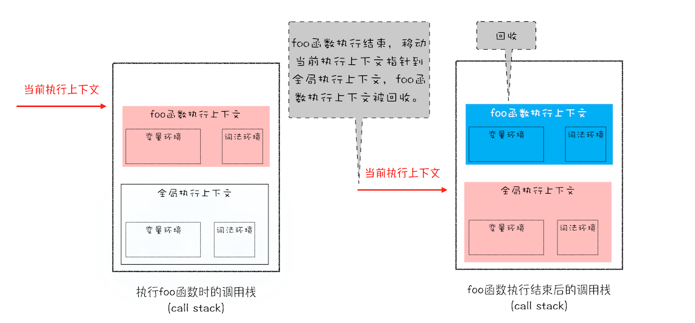

```js
function foo() {
  var a = 1;
  var b = a;
  a = 2;
  console.log(a); // 2
  console.log(b); // 1
}
foo();
```

```js
function foo() {
  var a = { name: " 小明 " };
  var b = a;
  a.name = " 小强 ";
  console.log(a); // {name: ' 小强 '}
  console.log(b); // {name: ' 小强 '}
}
foo();
```

## `JavaScript` 是什么类型的语言

`C`语言在定义变量之前，需要确定变量的类型

```c

int main()
{
   int a = 1;
   char* b = " hello ";
   bool c = true;
   return 0;
}
```

- 在使用之前需要确认变量数据类型的语言称为**静态语言**
- 在运行过程中需要检查数据类型的语言称为**动态语言**
- 支持隐式类型转换的语言称为**弱类型语言**
- 不支持隐式类型转换的语言称为**强类型语言**


`JavaScript` 是一种弱类型的、动态的语言

- **弱类型**，意味着不需要告诉 `JavaScript`引擎变量是什么数据类型
- **动态**，意味着一个变量可以保存不同类型的数据。

## `JavaScript` 的数据类型


- `typeof` 检测 `Null` 类型时，返回的是 `Object`,这是当初 `JavaScript`语言的一个`Bug`，一直保留至今，之所以一直没修改过来，主要是为了兼容老的代码。
- `Object` 是由 `key-value` 组成的，其中的`vaule`可以是任何类型，包括函数.`Object`中的函数又称为方法
- 前面的`7`种数据类型称为**原始类型**，对象类型称为**引用类型**.之所以把它们区分为两种不同的类型，是因为它们在内存中存放的位置不一样

## 内存空间

`JavaScript` 执行过程中， 主要有三种类型内存空间，分别是**代码空间**、**栈空间**和**堆空间**。

代码空间主要是存储可执行代码的

### 栈空间和堆空间

栈空间也就是调用栈，用来存储执行上下文

```js
function foo() {
  var a = " 极客时间 ";
  var b = a;
  var c = { name: " 极客时间 " };
  var d = c;
}
foo();
```

执行代码时，先编译，并创建执行上下文，然后再按照顺序执行代码。当执行到第 `3`行代码时，调用栈的状态


执行第 `4`行代码时


原始类型的数据值都是直接保存在**栈**中,引用类型的值是存放在**堆**中

为什么一定要分**堆**和**栈**两个存储空间呢？所有数据直接存放在**栈**中不就可以了吗？

`JavaScript`引擎需要用栈来维护程序执行期间上下文的状态，如果栈空间大了话，所有的数据都存放在栈空间里面，那么会影响到上下文切换的效率，进而又影响到整个程序的执行效率



执行第 `5`行代码时


原始类型的赋值会完整复制变量值，而引用类型的赋值是复制引用地址。

## 闭包

```js
function foo() {
  var myName = " 小明 ";
  let test1 = 1;
  const test2 = 2;
  var innerBar = {
    setName: function(newName) {
      myName = newName;
    },
    getName: function() {
      console.log(test1);
      return myName;
    },
  };
  return innerBar;
}
var bar = foo();
bar.setName(" 小强 ");
bar.getName();
console.log(bar.getName());
```

你应该有过这样的分析：由于变量 `myName、test1、test2` 都是原始类型数据，所以在执行`foo` 函数的时候，它们会被压入到调用栈中；当`foo`函数执行结束之后，调用栈中 `foo` 函数的执行上下文会被销毁，内部变量 `myName、test1、test2` 也应该一同被销毁。

实际上,当 `foo` 函数的执行上下文销毁时，`foo` 函数产生了闭包，变量 `myName` 和 `test1` 并没有被销毁，而是保存在内存中

分析这段代码的执行流程

- 当 `JavaScript`引擎执行到 `foo` 函数时，首先会编译，并创建一个空执行上下文。
- 在编译过程中，遇到内部函数 `setName`，`JavaScript`引擎还要对内部函数做一次快速的词法扫描，发现该内部函数引用了 `foo` 函数中的 `myName` 变量，由于是内部函数引用了外部函数的变量，所以 `JavaScript` 引擎判断这是一个闭包，于是在堆空间创建换一个`closure(foo)`的对象（这是一个内部对象，`JavaScript` 是无法访问的），用来保存`myName` 变量。
- 接着继续扫描到 `getName`方法时，发现该函数内部还引用变量 `test1`，于是 `JavaScript`引擎又将`test1` 添加到`closure(foo)`对象中
- `test2` 并没有被内部函数引用，所以 `test2` 依然保存在调用栈中

`return innerBar`时的调用栈状态


当执行到`foo`函数时，闭包就产生了；当 `foo`函数执行结束之后，返回的 `getName` 和 `setName` 方法都引用`clourse(foo)`对象，所以即使 `foo` 函数退出了，`clourse(foo)`对象依然被其内部的`getName`和 `setName` 方法引用。所以在下次调用 b`ar.setName`或者`bar.getName`时，创建的执行上下文中就包含了`clourse(foo)`。

产生闭包的核心有两步：
- 第一步是需要预扫描内部函数
- 第二步是把内部函数引用的外部变量保存到堆中。
