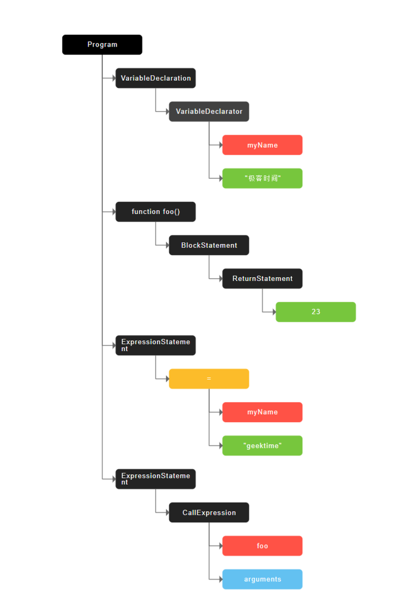

## 编译器和解释器

机器不能直接理解我们所写的代码，所以在执行程序之前，需要将我们所写的代码翻译成机器能读懂的机器语言。按语言的执行流程，可以把语言划分为编译型语言和解释型语言。

**编译型语言**在程序执行之前，需要经过编译器的编译过程，并且编译之后会直接保留机器能读懂的二进制文件，这样每次运行程序时，都可以直接运行该二进制文件，而不需要再次重新编译。比如 `C/C++`、`GO` 等。

**解释型语言**编写的程序，在每次运行时都需要通过解释器对程序进行动态解释和执行。比如 `Python`、`JavaScript` 等。

> 编译器和解释器翻译代码


## `V8`如何执行`JavaScript`代码


### 1. 抽象语法树（`AST`）和执行上下文

将源代码转换为抽象语法树，并生成执行上下文

编译器或者解释器是不理解高级语言的,所以要将源代码通过词法分析转换成`AST`。这和渲染引擎将`HTML` 转换为`DOM` 树的情况类似。

```js
var myName = " 极客时间 ";
function foo() {
  return 23;
}
myName = "geektime";
foo();
```



`AST` 是非常重要的一种数据结构，在很多项目中有着广泛的应用。其中最著名的一个项目是 `Babel`。`Babel`是一个被广泛使用的代码转码器，可以将 `ES6` 代码转为`ES5` 代码，这意味着你可以现在就用`ES6`编写程序，而不用担心现有环境是否支持`ES6`。`Babel` 的工作原理就是先将 `ES6` 源码转换为 `AST`，然后再将`ES6`语法的 `AST`转换为`ES5`语法的 `AST`，最后利用 `ES5` 的 `AST` 生成 `JavaScript`源代码。

除了 `Babel` 外，还有 `ESLint` 也使用 `AST`。`ESLint` 是一个用来检查 `JavaScript` 编写规范的插件，其检测流程也是需要将源码转换为`AST`，然后再利用 `AST` 来检查代码规范化的问题。

`AST`的生成过程:

- 分词（`tokenize`），又称为**词法分析**

将一行行的源码拆解成一个个 `token`。`token`就是指语法上不可能再分的、最小的单个字符或字符串。


- 解析（`parse`），又称为**语法分析**
  将生成的 `token`数据，根据语法规则转为 `AST`。如果源码符合语法规则，这一步就会顺利完成。但如果源码存在语法错误，这一步就会终止，并抛出一个语法错误。

有了`AST`后，`V8` 就会生成该段代码的执行上下文

### 2. 字节码

解释器`Ignition` 会根据 `AST`生成字节码，并解释执行字节码。

其实一开始`V8` 并没有字节码，而是直接将 `AST` 转换为机器码，由于执行机器码的效率是非常高效的，所以这种方式在发布后的一段时间内运行效果是非常好的。但是随着`Chrome`在手机上的广泛普及，特别是运行在 `512M` 内存的手机上，内存占用问题也暴露出来了，因为`V8`需要消耗大量的内存来存放转换后的机器码。为了解决内存占用问题，`V8`团队大幅重构了引擎架构，引入字节码，并且抛弃了之前的编译器，最终花了将进四年的时间，实现了现在的这套架构。

**字节码**就是介于 `AST` 和机器码之间的一种代码。但是与特定类型的机器码无关，字节码需要通过解释器将其转换为机器码后才能执行。

### 3. 执行代码

第一次执行的字节码，解释器`Ignition` 会逐条解释执行。在执行字节码的过程中，如果发现有热点代码（`HotSpot`），比如一段代码被重复执行多次，这种就称为热点代码，那么后台的编译器 `TurboFan` 就会把该段热点的字节码编译为高效的机器码，然后当再次执行这段被优化的代码时，只需要执行编译后的机器码就可以了，这样就大大提升了代码的执行效率。

解释器`Ignition` 是点火器的意思，编译器 `TurboFan`是涡轮增压的意思，寓意着代码启动时通过点火器慢慢发动，一旦启动，涡轮增压介入，其执行效率随着执行时间越来越高效率，因为热点代码都被编译器 `TurboFan` 转换了机器码，直接执行机器码就省去了字节码翻译为机器码的过程。

字节码配合解释器和编译器是最近一段时间很火的技术，比如 `Java` 和 `Python` 的虚拟机也都是基于这种技术实现的，我们把这种技术称为即时编译（`JIT`）。具体到`V8`，就是指解释器 `Ignition` 在解释执行字节码的同时，收集代码信息，当它发现某一部分代码变热了之后，`TurboFan` 编译器便把热点的字节码转换为机器码，并把转换后的机器码保存起来，以备下次使用。


虽然在 `V8 `诞生之初，也出现过一系列针对 `V8` 而专门优化` JavaScript `性能的方案，比如隐藏类、内联缓存等概念都是那时候提出来的。不过随着` V8 `的架构调整，你越来越不需要这些微优化策略了，相反，对于优化` JavaScript` 执行效率，你应该将优化的中心聚焦在单次脚本的执行时间和脚本的网络下载上，主要关注以下三点内容：
1. 提升单次脚本的执行速度，避免 `JavaScript` 的长任务霸占主线程，这样可以使得页面快速响应交互；
2. 避免大的内联脚本，因为在解析` HTML` 的过程中，解析和编译也会占用主线程；
3.  减少 `JavaScript` 文件的容量，因为更小的文件会提升下载速度，并且占用更低的内存。