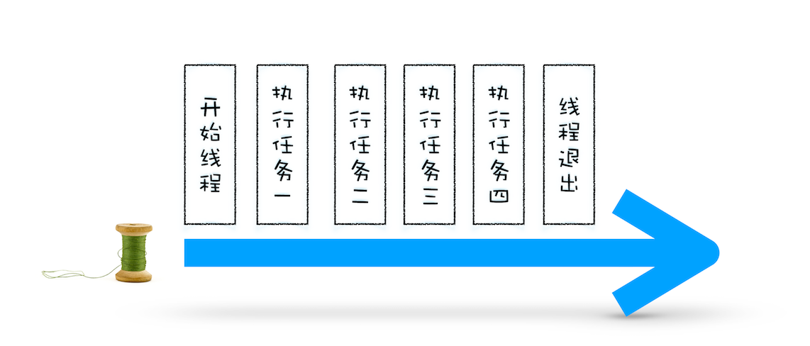
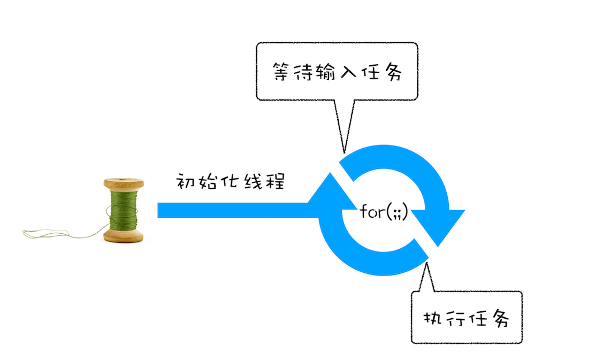

## 单线程处理安排好的任务

```c++
void MainThread(){
     int num1 = 1+2; // 任务 1
     int num2 = 20/5; // 任务 2
     int num3 = 7*8; // 任务 3
     print(" 最终计算的值为:%d,%d,%d",num,num2,num3)； // 任务 4
  }
```



## 线程运行过程中处理新任务

但并不是所有的任务都是在执行之前统一安排好的，大部分情况下，新的任务是在线程运行过程中产生的。比如在线程执行过程中，又接收到了一个新的任务要求计算`10+2`，那上面那种方式就无法处理这种情况了。

要想在线程运行过程中，能接收并执行新的任务，就需要采用**事件循环机制**

```c++
//GetInput
// 等待用户从键盘输入一个数字，并返回该输入的数字
int GetInput(){
    int input_number = 0;
    cout<<" 请输入一个数:";
    cin>>input_number;
    return input_number;
}

// 主线程 (Main Thread)
void MainThread(){
     for(;;){
          int first_num = GetInput()；
          int second_num = GetInput()；
          result_num = first_num + second_num;
          print(" 最终计算的值为:%d",result_num)；
      }
}
```

相较于第一版的线程，这一版的线程做了两点改进

- 第一点引入了循环机制，具体实现方式是在线程语句最后添加了一个`for` 循环语句，线程会一直循环执行。
- 第二点是引入了事件，可以在线程运行过程中，等待用户输入的数字，等待过程中线程处于暂停状态，一旦接收到用户输入的信息，那么线程会被激活，然后执行相加运算，最后输出结果。

通过引入事件循环机制，就可以让该线程“活”起来了，我们每次输入两个数字，都会打印出两数字相加的结果



## 处理其他线程发送过来的任务

上面我们改进了线程的执行方式，引入了事件循环机制，可以让其在执行过程中接受新的任务。不过在第二版的线程模型中，所有的任务都是来自于线程内部的，如果另外一个线程想让主线程执行一个任务，利用第二版的线程模型是无法做到的。

那下面我们就来看看其他线程是如何发送消息给渲染主线程的，具体形式你可以参考下图：


从上图可以看出，渲染主线程会频繁接收到来自于 `IO`线程的一些任务，接收到这些任务之后，渲染进程就需要着手处理，比如接收到资源加载完成的消息后，渲染进程就要着手进行 `DOM` 解析了；接收到鼠标点击的消息后，渲染主线程就要开始执行相应的`JavaScript`脚本来处理该点击事件。

那么如何设计好一个线程模型，能让其能够接收其他线程发送的消息呢？
一个通用模式是使用**消息队列**。在解释如何实现之前，我们先说说什么是消息队列，可以参考下图：


**消息队列**是一种数据结构，可以存放要执行的任务。它符合队列**先进先出**的特点，也就是说要添加任务的话，添加到队列的尾部；要取出任务的话，从队列头部去取。
有了队列之后，我们就可以继续改造线程模型了，改造方案如下图所示：


从上图可以看出，我们的改造可以分为下面三个步骤：

1. 添加一个消息队列；
2. `IO`线程中产生的新任务添加进消息队列尾部；
3. 渲染主线程会循环地从消息队列头部中读取任务，执行任务。

有了这些步骤之后，那么接下来我们就可以按步骤使用代码来实现第三版的线程模型。

首先，构造一个队列。

```c++
class TaskQueue{
  public:
  Task takeTask(); // 取出队列头部的一个任务
  void pushTask(Task task); // 添加一个任务到队列尾部
};
```

改造主线程，让主线程从队列中读取任务：

```c++
TaskQueue task_queue；
void ProcessTask();
void MainThread(){
  for(;;){
    Task task = task_queue.takeTask();
    ProcessTask(task);
  }
}
```

在上面的代码中，我们添加了一个消息队列的对象，然后在主线程的`for` 循环代码块中，从消息队列中读取一个任务，然后执行该任务，主线程就这样一直循环往下执行，因此只要消息队列中有任务，主线程就会去执行。

主线程执行的任务全部从消息队列中获取。如果有其他线程想要发送任务让主线程去执行，只需要将任务添加到该消息队列中就可以了，添加任务的代码如下：

```c++
Task clickTask;
task_queue.pushTask(clickTask)
```

由于是多个线程操作同一个消息队列，所以在添加任务和取出任务时还会加上一个同步锁

## 处理其他进程发送过来的任务

通过使用消息队列，实现了线程之间的消息通信。在 `Chrome` 中，跨进程之间的任务也是频繁发生的，那么如何处理其他进程发送过来的任务？


渲染进程专门有一个 `IO`线程用来接收其他进程传进来的消息，接收到消息之后，会将这些消息组装成任务发送给渲染主线程，后续的步骤就和前面处理其他线程发送的任务一样了

## 消息队列中的任务类型

消息队列中的任务包含了很多内部消息类型，如`输入事件（鼠标滚动、点击、移动）、微任务、文件读写、WebSocket、JavaScript 定时器`等等。还包含了很多与页面相关的事件，如 `JavaScript 执行、解析 DOM、样式计算、布局计算、CSS 动画`等。

以上这些事件都是在主线程中执行的，所以在编写 `Web` 应用时，你还需要衡量这些事件所占用的时长，并想办法解决单个任务占用主线程过久的问题。

## 如何安全退出

当页面主线程执行完成之后，`Chrome`确定要退出当前页面时，页面主线程会设置一个退出标志的变量，在每次执行完一个任务时，判断是否有设置退出标志。

如果设置了，那么就直接中断当前的所有任务，退出线程，你可以参考下面代码：

```c++
TaskQueue task_queue；
void ProcessTask();
bool keep_running = true;
void MainThread(){
  for(;;){
    Task task = task_queue.takeTask();
    ProcessTask(task);
    if(!keep_running) // 如果设置了退出标志，那么直接退出线程循环
        break;
  }
}
```

## 页面使用单线程的缺点

页面线程所有执行的任务都来自于消息队列。消息队列是**先进先出**的属性，也就是说放入队列中的任务，需要等待前面的任务被执行完，才会被执行。鉴于这个属性，就有如下两个问题需要解决。

### 1. 如何处理高优先级的任务

比如一个典型的场景是监控 `DOM` 节点的变化情况（节点的插入、修改、删除等动态变化），然后根据这些变化来处理相应的业务逻辑。一个通用的设计的是，利用 `JavaScript`设计一套监听接口，当变化发生时，渲染引擎同步调用这些接口，这是一个典型的观察者模式。

不过这个模式有个问题，因为 `DOM 变`化非常频繁，如果每次发生变化的时候，都直接调用相应的 `JavaScript`接口，那么这个当前的任务执行时间会被拉长，从而导致执行效率的下降。

如果将这些 `DOM` 变化做成异步的消息事件，添加到消息队列的尾部，那么又会影响到监控的实时性，因为在添加到消息队列的过程中，可能前面就有很多任务在排队了。

这也就是说，如果`DOM` 发生变化，采用同步通知的方式，会影响当前任务的执行效率；如果采用异步方式，又会影响到监控的实时性。

那该如何权衡效率和实时性呢？

针对这种情况，微任务就应用而生了，下面我们来看看微任务是如何权衡效率和实时性的。

通常我们把消息队列中的任务称为**宏任务**，每个宏任务中都包含了一个**微任务队列**，在执行宏任务的过程中，如果 `DOM`有变化，那么就会将该变化添加到微任务列表中，这样就不会影响到宏任务的继续执行，因此也就解决了执行效率的问题。

等宏任务中的主要功能都直接完成之后，这时候，渲染引擎并不着急去执行下一个宏任务，而是执行当前宏任务中的微任务，因为 `DOM` 变化的事件都保存在这些微任务队列中，这样也就解决了实时性问题。

### 2. 如何解决单个任务执行时长过久的问题

因为所有的任务都是在单线程中执行的，所以每次只能执行一个任务，而其他任务就都处于等待状态。如果其中一个任务执行时间过久，那么下一个任务就要等待很长时间。可以参考下图：


如果在执行动画过程中，其中有个 `JavaScript` 任务因执行时间过久，占用了动画单帧的时间，这样会给用户制造了卡顿的感觉，这当然是极不好的用户体验。针对这种情况，`JavaScript`可以通过回调功能来规避这种问题，也就是让要执行的 `JavaScript` 任务滞后执行

## 浏览器页面是如何运行的


从图中可以看出，点击展开了 `Main` 这个项目，其记录了主线程执行过程中的所有任务。图中灰色的就是一个个任务，每个任务下面还有子任务，其中的`Parse HTML`任务，是把 `HTML`解析为 `DOM`的任务。值得注意的是，在执行 `Parse HTML` 的时候，如果遇到 `JavaScript` 脚本，那么会暂停当前的`HTML` 解析而去执行 `JavaScript` 脚本。
