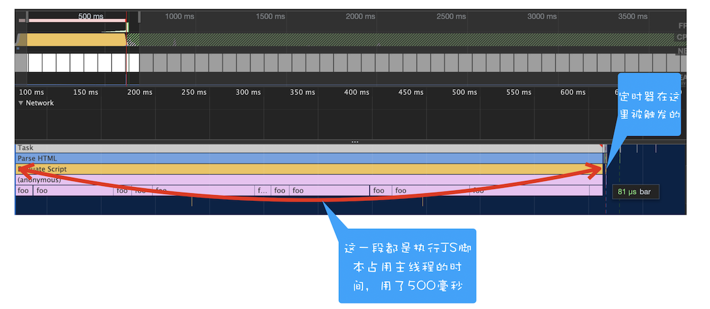

## 浏览器怎么实现 `setTimeout`

渲染进程中所有运行在主线程上的任务都需要先添加到消息队列，然后事件循环系统再按照顺序执行消息队列中的任务。下面我们来看看那些典型的事件：

- 当接收到`HTML`文档数据，渲染引擎就会将解析 `DOM`事件添加到消息队列中
- 当用户改变了`Web` 页面的窗口大小，渲染引擎就会将重新布局的事件添加到消息队列中。
- 当触发了 `JavaScript`引擎垃圾回收机制，渲染引擎会将垃圾回收任务添加到消息队列中。
- 如果要执行一段异步`JavaScript` 代码，也是需要将执行任务添加到消息队列中。

不过通过定时器设置回调函数有点特别，它们需要在指定的时间间隔内被调用，但消息队列中的任务是按照顺序执行的，所以为了保证回调函数能在指定时间内执行，你不能将定时器的回调函数直接添加到消息队列中。

那么该怎么设计才能让定时器设置的回调事件在规定时间内被执行呢？
在 `Chrome` 中除了正常使用的消息队列之外，还有另外一个消息队列，这个队列中维护了需要延迟执行的任务列表，包括了定时器和`Chromium`内部一些需要延迟执行的任务。所以当通过 `JavaScript` 创建一个定时器时，渲染进程会将该定时器的回调任务添加到延迟队列中。

源码中延迟执行队列的定义如下所示：

```c++
DelayedIncomingQueue delayed_incoming_queue;
```

当通过 `JavaScript`调用 `setTimeout` 设置回调函数的时候，渲染进程将会创建一个回调任务，包含了回调函数 `showName`、当前发起时间、延迟执行时间，其模拟代码如下所示：

```c++
struct DelayTask{
  int64 id；
  CallBackFunction cbf;
  int start_time;
  int delay_time;
};
DelayTask timerTask;
timerTask.cbf = showName;
timerTask.start_time = getCurrentTime(); // 获取当前时间
timerTask.delay_time = 200;// 设置延迟执行时间
```

创建好回调任务之后，再将该任务添加到延迟执行队列中，代码如下所示：

```c++
delayed_incoming_queue.push(timerTask)；
```

消息循环系统是怎么触发延迟队列的?

```c++
void ProcessTimerTask(){
  // 从 delayed_incoming_queue 中取出已经到期的定时器任务
  // 依次执行这些任务
}

TaskQueue task_queue；
void ProcessTask();
bool keep_running = true;
void MainTherad(){
  for(;;){
    // 执行消息队列中的任务
    Task task = task_queue.takeTask();
    ProcessTask(task);

    // 执行延迟队列中的任务
    ProcessDelayTask()

    if(!keep_running) // 如果设置了退出标志，那么直接退出线程循环
        break;
  }
}
```

`ProcessDelayTask`函数是专门用来处理延迟执行任务的。处理完消息队列中的一个任务之后，就开始执行 `ProcessDelayTask` 函数。`ProcessDelayTask` 函数会根据发起时间和延迟时间计算出到期的任务，然后依次执行这些到期的任务。等到期的任务执行完成之后，再继续下一个循环过程。通过这样的方式，一个完整的定时器就实现了。

设置一个定时器，`JavaScript` 引擎会返回一个定时器的 `ID`。那通常情况下，当一个定时器的任务还没有被执行的时候，也是可以取消的，具体方法是调用`clearTimeout` 函数，并传入需要取消的定时器的`ID`。如下面代码所示：

```js
clearTimeout(timer_id);
```

其实浏览器内部实现取消定时器的操作也是非常简单的，就是直接从 `delayed_incoming_queue` 延迟队列中，通过 `ID`查找到对应的任务，然后再将其从队列中删除掉就可以了。

## 使用 `setTimeout` 的一些注意事项

### 1. 如果当前任务执行时间过久，会影延迟到期定时器任务的执行

在使用 `setTimeout`的时候，有很多因素会导致回调函数执行比设定的预期值要久，其中一个就是当前任务执行时间过久从而导致定时器设置的任务被延后执行

```js
function bar() {
  console.log("bar");
}
function foo() {
  setTimeout(bar, 0);
  for (let i = 0; i < 5000; i++) {
    let i = 5 + 8 + 8 + 8;
    console.log(i);
  }
}
foo();
```

通过 `setTimeout`设置的回调任务被放入了消息队列中并且等待下一次执行，这里并不是立即执行的；要执行消息队列中的下个任务，需要等待当前的任务执行完成，由于当前这段代码要执行 `5000` 次的`for` 循环，所以当前这个任务的执行时间会比较久一点。这势必会影响到下个任务的执行时间。

执行 `foo` 函数所消耗的时长是 500 毫秒，这也就意味着通过`setTimeout`设置的任务会被推迟到 `500`毫秒以后再去执行，而设置 `setTimeout`的回调延迟时间是`0`。

### 2. 如果 `setTimeout` 存在嵌套调用，那么系统会设置最短时间间隔为`4` 毫秒

```js
function cb() {
  setTimeout(cb, 0);
}
setTimeout(cb, 0);
```


上图中的竖线就是定时器的函数回调过程，从图中可以看出，前面五次调用的时间间隔比较小，嵌套调用超过五次以上，后面每次的调用最小时间间隔是`4`毫秒。之所以出现这样的情况，是因为在 `Chrome`中，定时器被嵌套调用`5`次以上，系统会判断该函数方法被阻塞了，如果定时器的调用时间间隔小于 `4`毫秒，那么浏览器会将每次调用的时间间隔设置为`4`毫秒。下面是 Chromium 实现 `4`毫秒延迟的代码，你可以看下：

```c++
static const int kMaxTimerNestingLevel = 5;

// Chromium uses a minimum timer interval of 4ms. We'd like to go
// lower; however, there are poorly coded websites out there which do
// create CPU-spinning loops.  Using 4ms prevents the CPU from
// spinning too busily and provides a balance between CPU spinning and
// the smallest possible interval timer.
static constexpr base::TimeDelta kMinimumInterval = base::TimeDelta::FromMilliseconds(4);

base::TimeDelta interval_milliseconds =
      std::max(base::TimeDelta::FromMilliseconds(1), interval);

  if (interval_milliseconds < kMinimumInterval &&
      nesting_level_ >= kMaxTimerNestingLevel)
    interval_milliseconds = kMinimumInterval;

  if (single_shot)
    StartOneShot(interval_milliseconds, FROM_HERE);
  else
    StartRepeating(interval_milliseconds, FROM_HERE);
```

所以，一些实时性较高的需求就不太适合使用 `setTimeout` 了，比如你用`setTimeout` 来实现`JavaScript`动画就不是一个很好的主意。

### 3. 未激活的页面，`setTimeout` 执行最小间隔是 `1000` 毫秒

未被激活的页面中定时器最小值大于`1000`毫秒，也就是说，如果标签不是当前的激活标签，那么定时器最小的时间间隔是 `1000`毫秒，目的是为了优化后台页面的加载损耗以及降低耗电量。这一点你在使用定时器的时候要注意。

### 4. 延时执行时间有最大值

除了要了解定时器的回调函数时间比实际设定值要延后之外，还有一点需要注意下，那就是 `Chrome、Safari、Firefox`都是以`32`个 `bit`来存储延时值的，`32bit` 最大只能存放的数字是`2147483647`毫秒，这就意味着，如果 `setTimeout`设置的延迟值大于 `2147483647`毫秒（大约 `24.8`天）时就会溢出，这导致定时器会被立即执行。你可以运行下面这段代码：

```js
function showName() {
  console.log(" 极客时间 ");
}
var timerID = setTimeout(showName, 2147483648); // 会被理解调用执行
```

### 5. 使用`setTimeout` 设置的回调函数中的 `this` 不符合直觉

如果被 `setTimeout` 推迟执行的回调函数是某个对象的方法，那么该方法中的`this` 关键字将指向全局环境，而不是定义时所在的那个对象。

```js
var name = 1;
var MyObj = {
  name: 2,
  showName: function() {
    console.log(this.name);
  },
};
setTimeout(MyObj.showName, 1000);
```

这里输出的是 `1`，因为这段代码在编译的时候，执行上下文中的 `this`会被设置为全局 `window`，如果是严格模式，会被设置为 `undefined`。

那么该怎么解决这个问题呢？
```js
// 箭头函数
setTimeout(() => {
  MyObj.showName();
}, 1000);
// 或者 function 函数
setTimeout(function() {
  MyObj.showName();
}, 1000);
// 或者
setTimeout(MyObj.showName.bind(MyObj), 1000);
```
