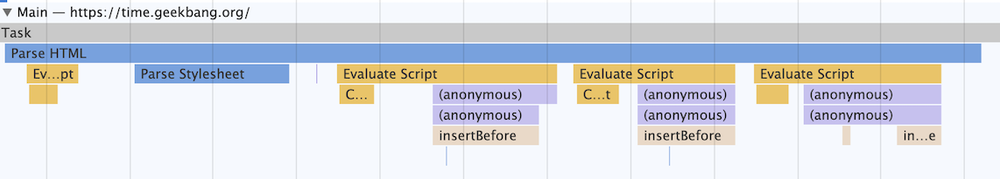
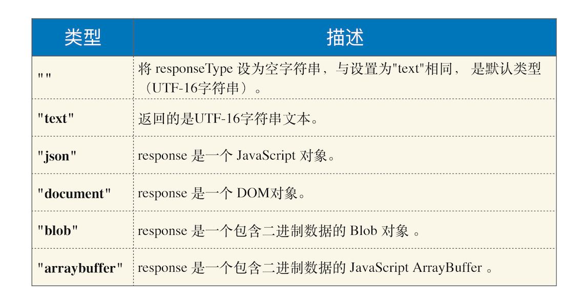
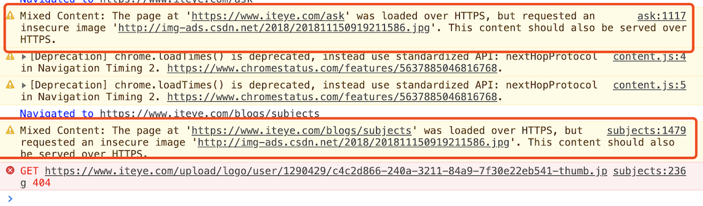

## 回调函数 VS 系统调用栈

将一个函数作为参数传递给另外一个函数，那作为参数的这个函数就是**回调函数**（`Callback Function`）

```js
let callback = function() {
  console.log("i am do homework");
};
function doWork(cb) {
  console.log("start do work");
  cb();
  console.log("end do work");
}
doWork(callback);
```

回调函数 `callback`是在主函数`doWork` 返回之前执行的，我们把这个回调过程称为**同步回调**

```js
let callback = function() {
  console.log("i am do homework");
};
function doWork(cb) {
  console.log("start do work");
  setTimeout(cb, 1000);
  console.log("end do work");
}
doWork(callback);
```

使用`setTimeout` 函数让`callback`在 `doWork`函数执行结束后，又延时了`1`秒再执行，`callback` 并没有在主函数 `doWork` 内部被调用，我们把这种回调函数在主函数外部执行的过程称为**异步回调**。

当循环系统在执行一个任务的时候，都要为这个任务维护一个系统调用栈。这个系统调用栈类似于 `JavaScript`的调用栈，只不过系统调用栈是 `Chromium`的开发语言 `C++` 来维护的，其完整的调用栈信息你可以通过 `chrome://tracing/`来抓取。当然，你也可以通过 `Performance` 来抓取它核心的调用信息

这幅图记录了一个 `Parse HTML`的任务执行过程，其中黄色的条目表示执行 J`avaScript`的过程，其他颜色的条目表示浏览器内部系统的执行过程。
`Parse HTML`任务在执行过程中会遇到一系列的子过程，比如在解析页面的过程中遇到了 `JavaScript`脚本，那么就暂停解析过程去执行该脚本，等执行完成之后，再恢复解析过程。然后又遇到了样式表，这时候又开始解析样式表……直到整个任务执行完成。
需要说明的是，整个 `Parse HTML` 是一个完整的任务，在执行过程中的脚本解析、样式表解析都是该任务的子过程，其下拉的长条就是执行过程中调用栈的信息。
每个任务在执行过程中都有自己的调用栈，那么同步回调就是在当前主函数的上下文中执行回调函数下面我们主要来看看异步回调过程，一般有两种方式：

1. 把异步函数做成一个任务，添加到信息队列尾部
2. 把异步函数添加到微任务队列中，这样就可以在当前任务的末尾处执行微任务了

## `XMLHttpRequest` 运作机制

> `XMLHttpRequest` 工作流程图


```js
function GetWebData(URL) {
  /**
   * 1: 新建 XMLHttpRequest 请求对象
   */
  let xhr = new XMLHttpRequest();

  /**
   * 2: 注册相关事件回调处理函数
   */
  xhr.onreadystatechange = function() {
    switch (xhr.readyState) {
      case 0: // 请求未初始化
        console.log(" 请求未初始化 ");
        break;
      case 1: //OPENED
        console.log("OPENED");
        break;
      case 2: //HEADERS_RECEIVED
        console.log("HEADERS_RECEIVED");
        break;
      case 3: //LOADING
        console.log("LOADING");
        break;
      case 4: //DONE
        if (this.status == 200 || this.status == 304) {
          console.log(this.responseText);
        }
        console.log("DONE");
        break;
    }
  };

  xhr.ontimeout = function(e) {
    console.log("ontimeout");
  };
  xhr.onerror = function(e) {
    console.log("onerror");
  };

  /**
   * 3: 打开请求
   */
  xhr.open("Get", URL, true); // 创建一个 Get 请求, 采用异步

  /**
   * 4: 配置参数
   */
  xhr.timeout = 3000; // 设置 xhr 请求的超时时间
  xhr.responseType = "text"; // 设置响应返回的数据格式
  xhr.setRequestHeader("X_TEST", "time.geekbang");

  /**
   * 5: 发送请求
   */
  xhr.send();
}
```

`responseType`配置服务器返回的格式


`setRequestHeader`配置请求头属性

渲染进程会将请求发送给网络进程，然后网络进程负责资源的下载，等网络进程接收到数据之后，就会利用`IPC` 来通知渲染进程；渲染进程接收到消息之后，会将 `xhr` 的回调函数封装成任务并添加到消息队列中，等主线程循环系统执行到该任务的时候，就会根据相关的状态来调用对应的回调函数。

## `XMLHttpRequest` 使用过程中的坑

### 1. 跨域问题

### 2. `HTTPS` 混合内容的问题

`HTTPS` 页面中包含了不符合 `HTTPS`安全要求的内容，比如包含了`HTTP`资源，通过`HTTP` 加载的图像、视频、样式表、脚本等，都属于混合内容。
通常，如果 `HTTPS`请求页面中使用混合内容，浏览器会针对 `HTTPS` 混合内容显示警告，用来向用户表明此`HTTPS`页面包含不安全的资源

