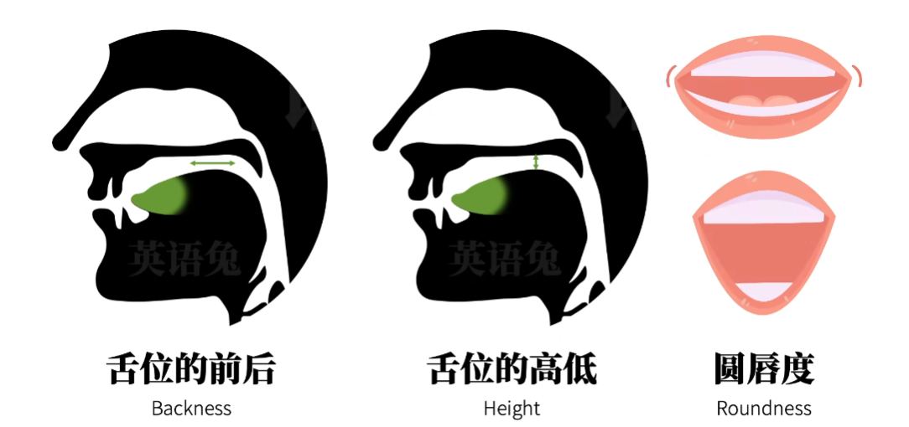
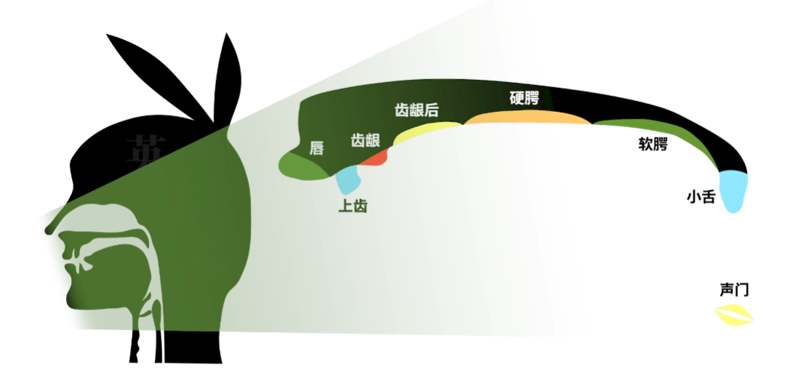
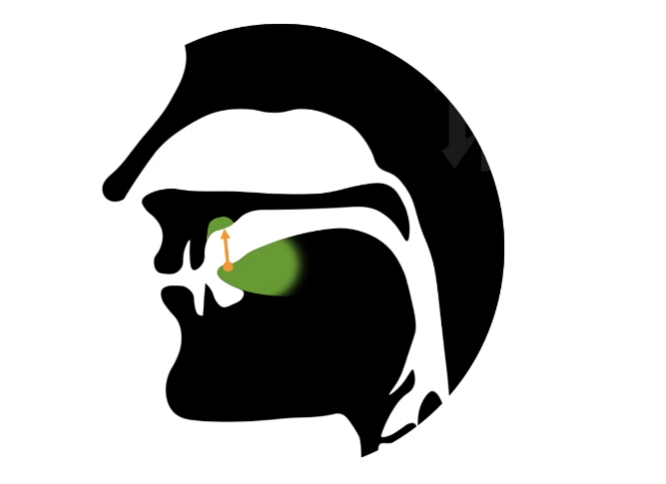
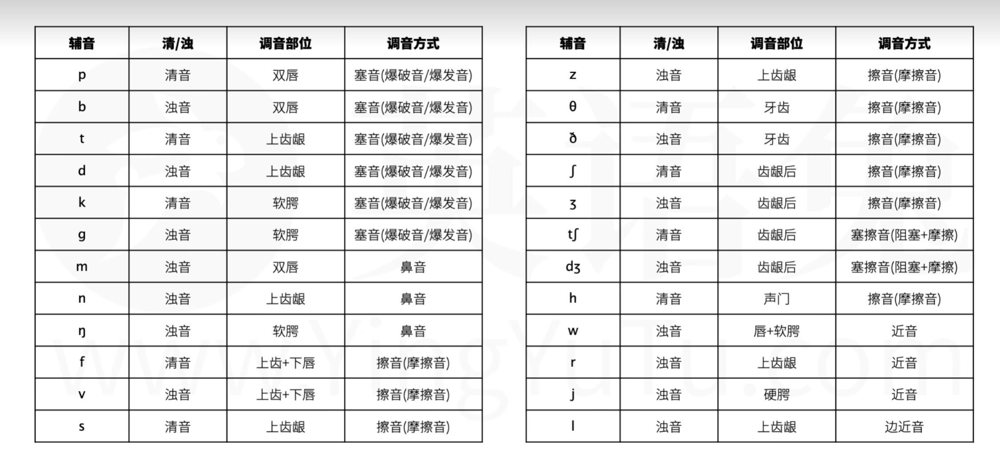
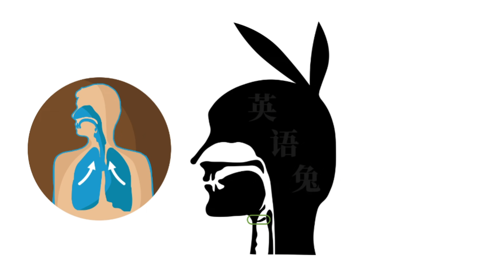

## 音标

来源自： [b 站英语兔](https://www.bilibili.com/video/BV1iV411z7Nj?p=1&vd_source=50f8bf5cacad4289b7991cb0e05a0ad0)

- 英式英语`DJ`音标
- 美式英语`kk`音标

区分元音决定性三要素是:

- 舌位的前后
- 舌位的高低
- 圆唇度
  

> 舌位粗略的理解为 `发音时舌面隆起的最高点在口腔中的位置`

比如

- `币(bi)`的韵母`i`舌位前且高
- `兔(tu)`的韵母`u`舌位后且高,圆唇度高
- `哈(ha)`的韵母`a`舌位中且低

区分辅音决定性三要素是:

1. 清浊,发声时声带是否振动,清音不振动,浊音振动
2. 调音部位,发音时最主要用到的阻挡气流的发音器官
   

3. 调音方式,以什么样的方式阻塞气流发出辅音

比如: `兔(tu)`的声母`t`

- 清音,发声时声带不振动
- 发音时舌尖抵住上齿龈
  

- 发音方式是用舌尖抵住上齿龈完全阻塞气流,形成气压,然后舌尖离开上齿龈,释放气流,发声声响,这种调音方式被称作`塞音`,俗称`爆破音`

国内音标教学保留了以下`4`个音标,导致国内音标有`48`个,而某些国外音标只有 `44`个

- `/ts/`
  - 清音,同拼音`c`
- `/dz/`
  - 浊音,
- `/tr/`
  - 清音
- `/dr/`
  - 浊音

> 肺部产生气流,挤压,上行,来到喉咙这里的`声门`,这就是发音的动力,声门是两瓣声带的开口,当气流从肺部冲出声门时,让气流振动声带,再让气流上行,这种称为浊音,气流通过声门时不振动声带,直接给气流放行,这种称为清音
发音过程中,气流通过口腔时不受阻碍(舌头不与任何口腔部位接触)发出的音,称为元音,气流在全部时间或一部分时间被阻碍发出的音,称为辅音
## 十大词性

1. `none` 名词
2. `pronone` 代词
3. `numeral` 数词
4. `arterle` 冠词
5. `verb` 动词
6. `adverb` 副词
7. `adjective` 形容词
8. `preposition` 介词
9. `conjunction` 连词
10. `interjection` 感叹词

## 九大成分

1. `subject` 主语
2. `predicate` 谓语
3. `object` 宾语
4. `subject complement` 表语
5. `object complement` 宾补
6. `attribute` 定语
7. `adverbial` 状语
8. `apposition` 同位语
9. `double object` 双宾

## 八大句型

### 五个简单句

1. 主 + 谓
2. 主 + 谓 + 宾
3. 主 + 系 + 表
4. 主 + 谓 + 宾 + 宾补
5. 主 + 谓 + 双宾

### 三个复合句

1. 名词性从句
2. 定语从句
3. 状语从句
