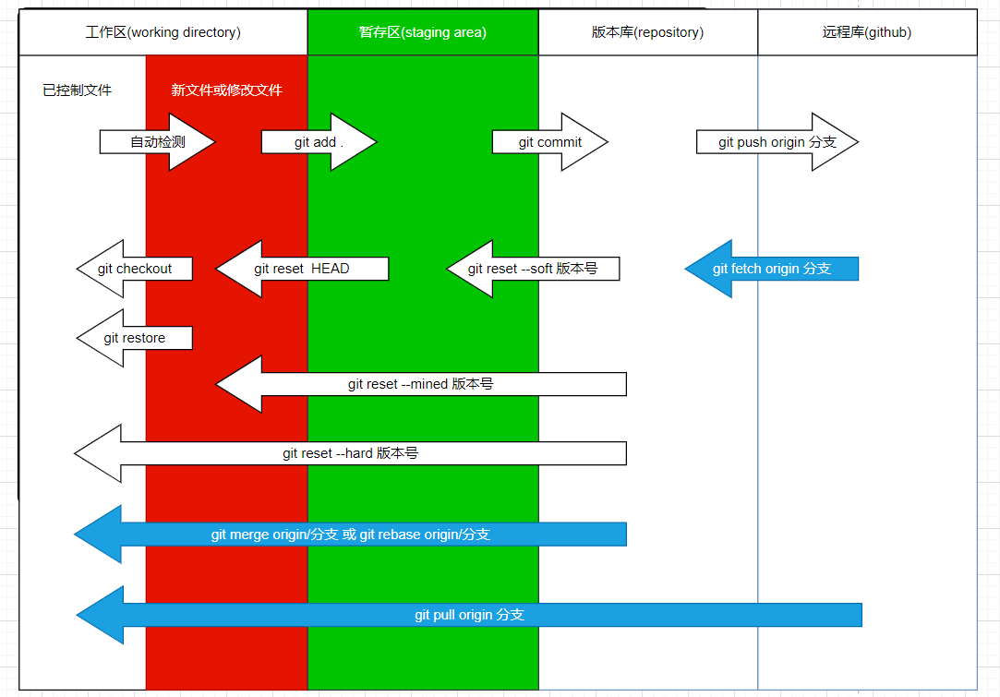

## 图解

## 基本命令
``` sh
git init              # 初始化Git仓库 空目录 or 有文件的目录都可以
git status            # 查看文件状态
git add .             # 将所有文件添加到暂存区
git commit -m "描述"  # 提交到版本库,生成版本
git log               # 查看所有commit记录
git reflog            # 查看所有 commit和reset的记录
git config --list     # 检查已有的配置信息
```
## 版本回退
``` sh
# HEAD     当前版本
# HEAD^    上个版本
# HEAD~10  往上 10 个版本

git reset --soft HEAD^      # 回退到上个版本,会保留源码(在暂存区)
git reset --hard HEAD^      # 回退到上个版本,不保留源码
git reset --mixed HEAD^     # 回退到上个版本,保留源码(在工作区)
git reset HEAD^             # 回退到上个版本,保留源码(在工作区)
git reset --hard 3f77907    # 根据 commit id 回退
```
## 分支
::: details 正在开发新功能,已有功能出现 BUG,怎么办?
1. 在开发新功能时,在主分支上创建一个`dev分支`来开发新功能
2. 如果之前的功能有BUG,可以切换回主分支创建一个`bug分支`去处理
3. 处理完合并到主分支,然后再切换到dev分支上继续开发
4. 开发完毕后要合并到主分支,这时会有冲突,因为dev分支指向的是合并修复bug之前的主分支,找到冲突的文件手动处理,然后再提交
:::
::: tip 提示
- 默认主分支名:`master`
- 各个分支互不影响
:::
``` sh
git branch            # 查看当前分支
git branch dev        # 创建 dev 分支
git checkout dev      # 切换 dev 分支
git checkout -b dev   # 创建并切换到dev分支
git merge dev         # 合并分支(必须切换到主分支合并)
git branch -d dev     # 删除分支
```
## GitHub
``` sh
git remote add origin 仓库地址    # 为远程仓库地址起个别名
> # git remote 查看远程库信息
> # origin 是仓库地址的别名
git push -u origin master    # 将本地代码推送到 origin 仓库 master 主分支
git push -u origin dev       # 将本地代码推送到 origin 仓库 dev 分支
git clone 仓库地址            # 克隆远程仓库到本地
> # 如果远程库有多个分支, git branch 只能看到主分支,其实是有的,直接切换就行
```
## SSH
``` sh
# 设置个人信息
git config --global user.name "Luke.Deng"                  
git config --global user.email  "xiangshuo1992@gmail.com"
cd ~
ssh-keygen -t rsa -C "youremail@example.com"    # 创建SSH Key,会生成 id_rsa 和 id_rsa.pub 
cat ~/.ssh/id_rsa.pub                           # 复制公共密匙
```
## 解决问题

> 在 dev 分支上干活,一定要保证 dev 的代码与主分支的代码保持一致,版本不能落后主分支,如果主分支有新版本,dev 的代码就不是最新的了
``` sh
git merge master  # 将主分支的代码合并到当前分支
```

``` sh
git pull origin master      # 拉取主分支的代码
# 等同于
git fetch origin master     # 将远程库的代码拉到版本库
git merge origin/master     # 将版本库的该分支的代码合并到工作区
> # origin/master表示它是从远程库拉取的分支,存在版本库中
```
::: tip 提示
开发完毕,将 dev 分支合并到主分支,push 到远程库,将主分支合并到 dev 分支,push 到远程库
:::

>在公司写代码提交到了版本库但没有 push 到远程库,回到家没办法获取只好写点其他的功能并 push 到了远程库,第二天回到公司,拉取在家写的代码就会与本地未 push 到远程库的代码自动合并,同一行被改动可能会产生合并冲突,这时可以根据提示手动解决冲突,解决完毕继续开发,开发完毕 push 到远程库

## rebase(变基)
> 使 git 记录简洁
::: tip 案例一
在一个分支上做一个功能,可能会产生很多提交记录,显得很臃肿,老板只想看初始代码和完成后的代码,`rebase`可以将多个记录整合成一个记录
:::
``` sh
git rebase -i 版本号      # 最新版本号与该版本号区间的版本合并
git rebase -i HEAD~3      # 从当前最新版本开始找最近的3个版本合并
# 已经提交到远程仓库的版本建议不要使用此命令合并
```
::: tip 案例二

主分支有新的版本,但曾基于之前版本创建过 dev 分支,dev 分支也有新提交的版本,这时想合并,可以将 dev 分支的代码强插到主分支
:::
``` sh
# 先切到dev分支
git rebase master   # 将 dev 分支的代码强插到主分支
> # 有可能出现冲突,先解决冲突,然后`git add`,然后git rebase --continue
# 切换到主分支
git merge dev
# 强插是一条直线 看不出来合并的痕迹,而使用之前的合并方法有层级
git log --graph --pretty=format:"%h %s"
```
::: tip 案例三
本地分支代码没提交,远程仓库的该分支有新提交的代码,使用`pull`命令的话,会合并,可能会有冲突,而且在提交记录中会出现分叉
:::
``` sh
git pull origin dev
# 替换为
git fetch origin dev      # 将远程库的代码拉到版本库
git rebase origin/dev     
```
## 给开源软件贡献代码

1. `Fork`该项目,意思是将别人的项目拷贝到自己的仓库
2. 将其拉到本地,进行修改,最后 `push`
3. 给源代码作者提交修复 bug 的申请(点击`new pull request`)

## 配置文件
项目配置文件(当前项目下`.git`目录下`config`文件)
``` sh
git config --local user.name "李四"
git config --local user.email "lisi@xx.com"
```
全局配置文件(`C:\Users\86187`下`.gitconfig`文件)
``` sh
git config --global user.name "李四"
git config --global user.email "lisi@xx.com"
```
- 系统配置文件(`/etc/gitconfig`)
``` sh
git config --system user.name "李四"
git config --system user.email "lisi@xx.com"
# 注意: 需要root权限
```
## 忽略文件
`.gitignore`文件为忽略文件,忽略 未 add 在工作区的文件

``` sh
index.html       # 忽略index.html  
details.html     # 忽略details.html 
*.html           # 忽略所有.html文件
.gitignore       # 忽略自身
files/     			 # 忽略files目录下所有文件
!index.html			 # 除了index.html以外
*.py[c|a|d]      # 忽略所有.pyc .pya .pyd
```