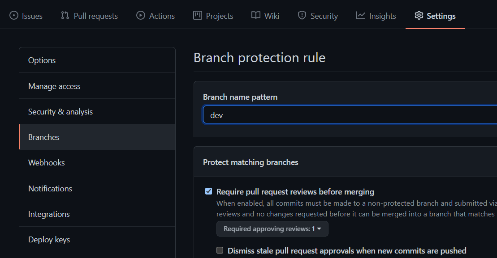

1. 先在本地git初始化项目,push到远程库
2. 邀请队友
  - 方式一: 通过仓库邀请

  - 方式二: 创建组织邀请(本次使用这个)

``` sh
git tag -a v1 -m "第一版"     # 为当前版本打标签,名为 v1 后跟描述
git push origin --tags        # 推送标签,这时远程仓库就有了tags,v1标签
git checkout -b dev          # 创建并切换到dev分支
git push origin dev          # 将当前版本项目推送到远程库的dev分支
```
3. 同事小张入场开发新功能
   - clone项目
   - 切换到dev分支
   - 创建并切换到ddz分支
   - 开发期间正常add/commit/push origin dev 
   - 开发完毕,通过`New pull requests`让组长`reviews`,需要进行如下配置,意思你想要合并到dev分支需要让组长`reviews`
     - 
   - 组长收到检查完毕,没问题就可以让这个分支合并了,合并完毕组长本地要在dev分支下拉取最新的代码
4. 进入测试环节,在`dev`分支下创建并切换`release`分支,然后`git push origin release`,修修改改
5. 将`release`分支合并到主分支之前,也要`New pull requests`
6. 远程仓库合并之后,本地库也要合并
   ``` sh 
   git checkout dev           # 切换到dev分支
   git merge release          # 将release分支合并到dev分支
   git branch -d release      # 删除 release 分支
   git checkout master        # 切换到主分支
   git pull origin master     # 拉取主分支最新代码
   git tag -a v2 -m "第二版"  # 打标签
   git push origin --tags     # 将标签推送到远程仓库
   ```


